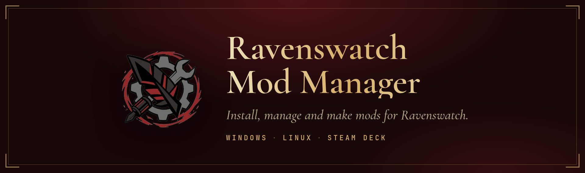
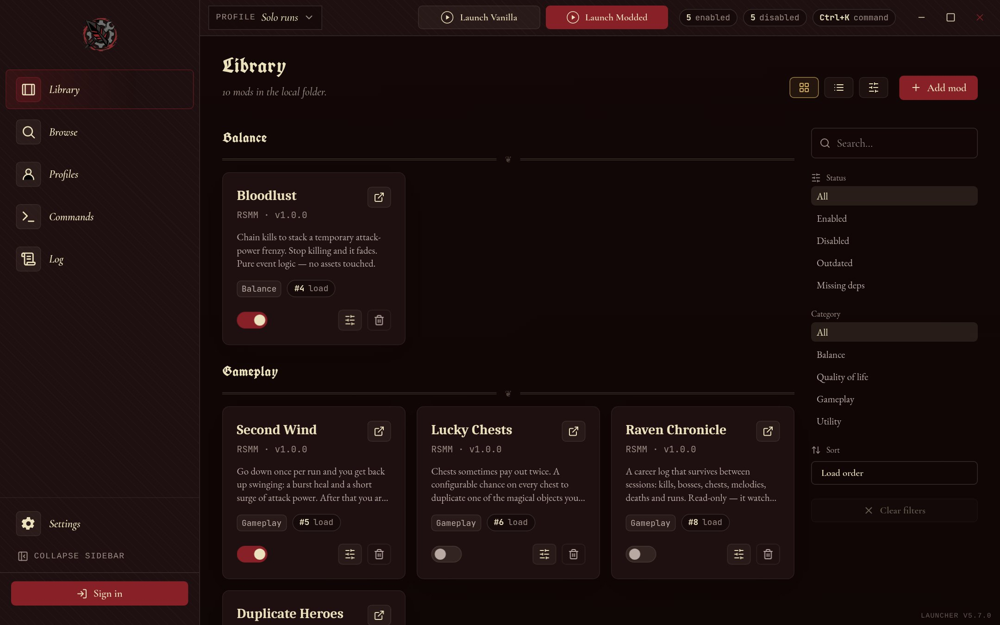
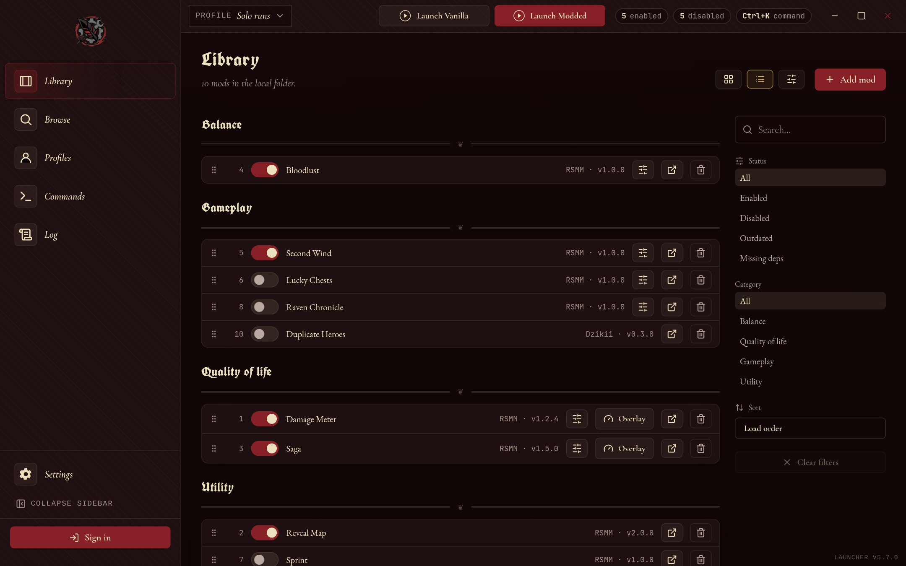
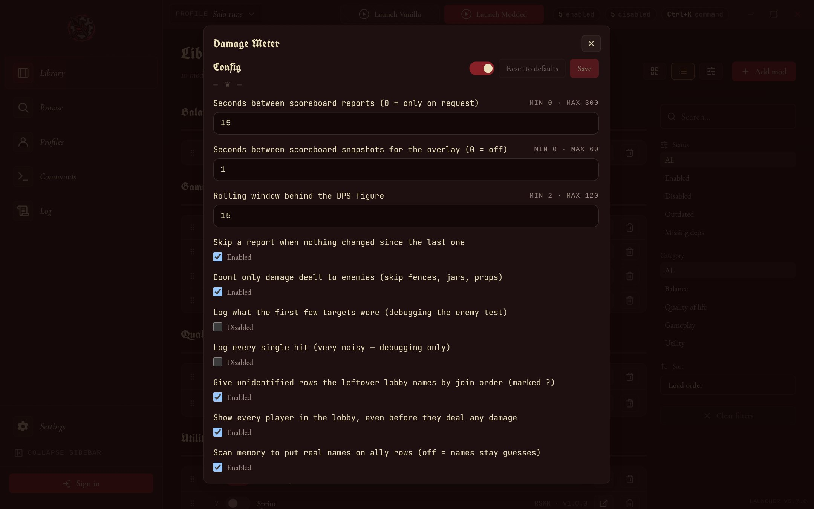
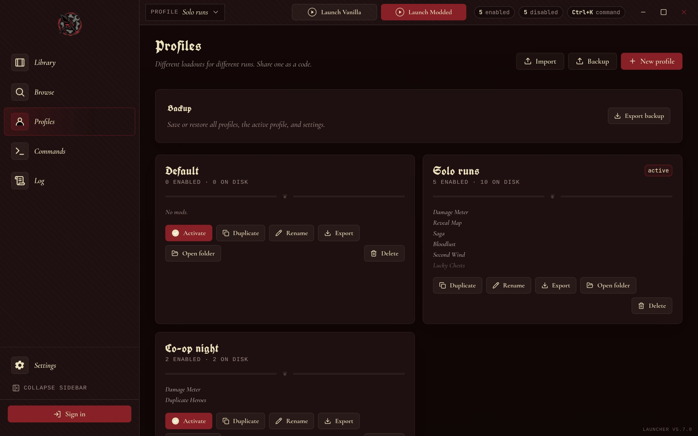

<p align="center">
  
</p>

<p align="center">
  <a href="https://github.com/Ovilli/RavenswatchModManager/releases/latest"><b>Download</b></a>
  &nbsp;·&nbsp;
  <a href="https://rsmm.me/registry"><b>Browse mods</b></a>
  &nbsp;·&nbsp;
  <a href="https://docs.rsmm.me"><b>Documentation</b></a>
  &nbsp;·&nbsp;
  <a href="https://docs.rsmm.me/getting-started/first-mod/"><b>Make a mod</b></a>
</p>

<p align="center">
  <a href="https://github.com/Ovilli/RavenswatchModManager/releases/latest"></a>
  <a href="https://github.com/Ovilli/RavenswatchModManager/releases"></a>
  <a href="LICENSE"></a>
</p>

<p align="center">
  
</p>

<table>
<tr>
<td width="50%" valign="top">

### For players

A desktop app that finds your game, installs mods from
[rsmm.me](https://rsmm.me/registry) in a click and applies them for you.
Every file it changes is backed up, so the unmodded game is always one click away.

**[Get the app →](#getting-started)**

</td>
<td width="50%" valign="top">

### For mod authors

A command-line tool and SDK for changing textures, models, stats, text and items,
scripting gameplay in Lua, and publishing to the site with one command.

**[Make your first mod →](#making-mods)**

</td>
</tr>
</table>

## Getting started

| Windows 10/11 | Linux (any distro) | Debian / Ubuntu |
| :---: | :---: | :---: |
| [`RSMM-x64.msi`](https://github.com/Ovilli/RavenswatchModManager/releases/latest) | [`RSMM-x86_64.AppImage`](https://github.com/Ovilli/RavenswatchModManager/releases/latest) | [`rsmm_amd64.deb`](https://github.com/Ovilli/RavenswatchModManager/releases/latest) |

The app keeps itself up to date after the first install. Steam Deck works through the Linux build.

1. **Open RSMM.** It looks for Ravenswatch in your Steam library. If it can't find
   it, choose the folder that contains `Ravenswatch.exe`.
2. **Add mods** from the **Browse** tab, or drop a mod folder into your library.
3. **Press Apply.** This writes the enabled mods into the game. Enabling or
   disabling a mod does nothing until you apply.
4. **Start the game.**

To go back to the unmodded game, disable your mods and apply again, or use
**Restore** to undo everything at once.

<table>
<tr>
<td width="33%" valign="top"><br><sub><b>List view.</b> Every mod in the active profile at a glance, in load order.</sub></td>
<td width="33%" valign="top"><br><sub><b>Mod settings.</b> Change a mod's options without editing any files.</sub></td>
<td width="33%" valign="top"><br><sub><b>Profiles.</b> Keep separate mod setups and share them as a code.</sub></td>
</tr>
</table>

## What mods can change

| Area | What you can change |
| --- | --- |
| **Look and sound** | Textures, 3D models and audio |
| **Balance** | Hero and enemy stats, talent values, magical-object values |
| **Text** | Any in-game string, including full translations |
| **New content** | Custom magical objects. Enemies, maps, shops and rewards are supported but still experimental, and mods that use them say so |
| **Scripted gameplay** | Lua scripts running in the game through the loader |

Many mods have their own settings: press **Config** on a mod to change them before applying.

> [!NOTE]
> Mods only change files on your own machine. Cosmetic mods are fine in co-op. Mods
> that change balance or content can behave differently for other players, so check a
> mod's description before bringing it into someone else's lobby.

## Making mods

Mod authoring uses the `rsmm` CLI, which needs Python 3.11 or newer.

```sh
git clone https://github.com/Ovilli/RavenswatchModManager
cd RavenswatchModManager
python3 -m venv .venv && source .venv/bin/activate    # Windows: .venv\Scripts\activate
pip install -e .
```

```sh
rsmm new my-first-mod --kind item    # start from a copy of an existing magical object
rsmm lint my-first-mod               # check it
rsmm apply                           # try it in the game
rsmm publish my-first-mod            # upload it to rsmm.me
```

A mod is a `manifest.toml` describing what it changes, plus any assets it needs.
`rsmm watch` re-applies it every time you save. Publishing needs an API token from your
[rsmm.me account](https://rsmm.me/account). Every upload is malware-scanned before it
appears on the site.

<table>
<tr>
<td><b><a href="https://docs.rsmm.me/getting-started/first-mod/">Your first mod</a></b><br>A step-by-step walkthrough</td>
<td><b><a href="https://docs.rsmm.me/guides/modding/">Modding guide</a></b><br>Every manifest field</td>
<td><b><a href="https://docs.rsmm.me/guides/sdk/">Lua SDK</a></b><br>Scripting gameplay</td>
<td><b><a href="docs/ExampleMods">Example mods</a></b><br>Working mods to copy</td>
</tr>
</table>

### Lua mods

Most mods are plain file changes and work wherever the game runs. Lua mods also need
the loader, a small DLL that runs next to the game:

```sh
rsmm install-loader    # install the loader and the Lua SDK into the game folder
rsmm log -f            # follow the loader log
```

On Linux under Proton, add `WINEDLLOVERRIDES="winhttp=n,b" %command%` to the game's
Steam launch options.

## If something goes wrong

<details>
<summary><b>Common problems and fixes</b></summary>
<br>

| Problem | Fix |
| --- | --- |
| Mods don't show up in the game | Press **Apply** after changing mods |
| The game crashes | Run `rsmm safe-mode`, or restore and re-enable mods one at a time |
| A game update broke things | Restore, let Steam verify the game files, then apply again |
| Gray window on Debian/Ubuntu | Start the app with `WEBKIT_DISABLE_DMABUF_RENDERER=1 WEBKIT_DISABLE_COMPOSITING_MODE=1` |
| The app won't open on Windows | Install [WebView2](https://learn.microsoft.com/en-us/microsoft-edge/webview2/) |

</details>

`rsmm doctor` checks your setup and reports what it finds. More fixes are in the
[troubleshooting guide](https://docs.rsmm.me/getting-started/troubleshooting/). If you're
still stuck, [open an issue](https://github.com/Ovilli/RavenswatchModManager/issues) with
your OS, RSMM version and the `rsmm doctor` output.

## Contributing

Bug reports, mods, documentation fixes and reverse-engineering findings are all welcome.
[Development setup](https://docs.rsmm.me/contributing/setup/) explains how to build the app,
the website and the loader. [Architecture](https://docs.rsmm.me/architecture/overview/)
explains how mods are applied, and `CLAUDE.md` is a detailed technical brief of the repo.

<details>
<summary><b>Repository layout</b></summary>
<br>

```
src/rsmm/     CLI and modding SDK (Python)
src/loader/   Lua loader DLL (C++)
apps/         desktop app (Tauri), website (Next.js), API (Hono), docs (Starlight)
packages/     shared TypeScript packages
docs/         example mods
data/         engine symbol map and generated asset data
```

</details>

## Support

RSMM is free and open source. If you'd like to support it:

<a href="https://ko-fi.com/W7W41FW3YE"></a>

---

<sub>MIT licensed, see [LICENSE](LICENSE). The loader includes MinHook, Dear ImGui and Lua 5.4,
whose licenses are in [THIRD_PARTY_NOTICES.md](THIRD_PARTY_NOTICES.md). RSMM does not modify
`Ravenswatch.exe` or bypass anti-cheat, contains no game assets, and requires a legitimate copy
of the game. Not affiliated with Passtech Games or Nacon.</sub>
