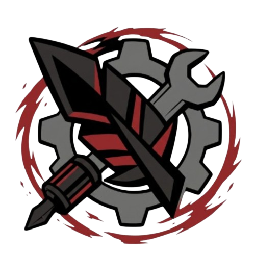

<p align="center">
  
</p>

<h1 align="center">Ravenswatch Mod Manager</h1>

<p align="center">
  <b>Install, manage, and build mods for <a href="https://store.steampowered.com/app/2071280/Ravenswatch/">Ravenswatch</a>.</b><br>
  Swap textures, retune stats and talents, translate the game, add custom magic items, or script gameplay in Lua —<br>
  from a desktop app (no terminal) or a full CLI + modding SDK.
</p>

<p align="center">
  <a href="https://github.com/Ovilli/RavenswatchModManager/releases/latest"></a>
  <a href="https://github.com/Ovilli/RavenswatchModManager/releases/latest"></a>
  <a href="https://docs.rsmm.me"></a>
  <a href="LICENSE"></a>
</p>

---

## Start here

| I want to… | Go to |
|---|---|
| **Play with mods** | [Install the desktop app](#1-install-the-desktop-app) — 2 minutes, no terminal |
| **Make a mod** | [Make your first mod](#make-your-first-mod) → [Authoring guide](https://docs.rsmm.me/guides/modding/) |
| **Script gameplay in Lua** | [Lua mods](#lua-mods-windows) (needs the loader DLL) |
| **Work on RSMM itself** | [Dev setup](https://docs.rsmm.me/contributing/dev-setup/) · [Architecture](https://docs.rsmm.me/architecture/overview/) |

Ravenswatch ships on **Windows**, and runs on **Linux** via Proton / Steam Deck. RSMM supports both. There is no native macOS build of the game.

---

## 1. Install the desktop app

| Platform | Download |
|---|---|
| **Windows** 10/11 | [`RSMM-x64.msi`](https://github.com/Ovilli/RavenswatchModManager/releases/latest) |
| **Linux** — any distro | [`RSMM-x86_64.AppImage`](https://github.com/Ovilli/RavenswatchModManager/releases/latest) (`chmod +x`, then run) |
| **Linux** — Debian/Ubuntu | [`rsmm_amd64.deb`](https://github.com/Ovilli/RavenswatchModManager/releases/latest) |
| **Linux** — Arch | [AUR](https://aur.archlinux.org/packages/rsmm): `yay -S rsmm` |

The app auto-updates itself from GitHub releases.

## 2. First run

1. **Open RSMM.** It auto-detects your Steam install of Ravenswatch. If it doesn't, point it at the folder containing `Ravenswatch.exe`.
2. **Click Doctor.** Health check — game path, asset map, mod validity, conflicts. Fix anything it flags before continuing.
3. **Registry tab** → browse community mods → **Install**. Or drop a mod folder into your mods directory (below).
4. **Click Apply.** This is the step that actually writes the mods into your game. Nothing changes in-game until you Apply.
5. **Click Play.**

> **Apply is not automatic.** Installing/enabling a mod only changes RSMM's own state. Re-Apply after every change.

**Where mods live** (desktop app, per profile):

| OS | Path |
|---|---|
| Windows | `%APPDATA%\rsmm\mods\profiles\<profile>\` |
| Linux | `~/.local/share/rsmm/mods/profiles/<profile>/` |

One folder per mod, each with a `manifest.toml`. From a source checkout the CLI uses `./mods/` instead (override with `RSMM_MODS_DIR`).

## 3. Going back to vanilla

RSMM backs up every file it touches as `<file>.rsmm.bak` and tracks state in the game folder, so uninstall is complete and reversible.

- **Desktop:** disable/uninstall the mod → **Apply**. To wipe everything, use the Restore action.
- **CLI:** `rsmm restore --all`
- **Nuclear option:** Steam → Ravenswatch → Properties → Installed Files → *Verify integrity of game files*.

> Also do this **before a game update**, and re-Apply afterwards. A patch can change the assets your mods override.

---

## What you can do

✅ works today · ⬜ planned (not built yet)

| Capability | Desktop app | CLI / SDK |
|---|---|---|
| Install mods (local folder or registry) | ✅ Click to install | `rsmm apply` |
| Swap textures / models / audio | ✅ Built-in | `rsmm apply` |
| Edit balance numbers | ⬜ Planned | ✅ `m.stat()` / `[[patch]] kind="stat"` |
| Edit talent & item values | ⬜ Planned | ✅ `rsmm talents`, `value_patches` |
| Override translations | ⬜ Planned | ✅ `m.text()` / `[[patch]] kind="text"` |
| Add a custom magic item | ⬜ Planned | ✅ `kind="item"` |
| Multiple mod profiles | ✅ Dropdown | via `RSMM_MODS_DIR` |
| Health check | ✅ Doctor button | ✅ `rsmm doctor` |
| Launch the game | ✅ Play button | ✅ `rsmm run` |
| Author + package mods | — | ✅ `rsmm new`, `rsmm lint`, `rsmm pack` |
| Live re-apply on file change | — | ✅ `rsmm watch` |
| Lua-scripted gameplay mods | — | ✅ SDK + loader DLL (Windows) |

**How honest is a given feature?** Every content kind carries a confidence rating — `confirmed` (proven in-game), `experimental`, or `guess`. `item` and `talent` are confirmed; enemies, heroes, maps, bosses, skins and friends are not. RSMM refuses to build a non-confirmed kind unless the mod opts in explicitly. See the [confidence table](https://docs.rsmm.me/concepts/content-kinds/).

**Registry status:** the community registry is new and holds few mods so far — most people install mods they were handed directly.

**Multiplayer:** mods change *your* local files. A cosmetic mod is safe; anything touching balance or content can desync or simply not apply for peers, and Ravenswatch is host-authoritative for most gameplay. Mods declare a `multiplayer_scope` (`cosmetic` / `deterministic-shared` / `host-authoritative` / `local-only`) — check it before playing online, and don't ship gameplay mods into strangers' lobbies.

---

## Make your first mod

Mods ship **data, not code**: a declarative `manifest.toml` plus assets. No bespoke scripts (`rsmm lint` and CI enforce this).

```sh
git clone https://github.com/Ovilli/RavenswatchModManager.git
cd RavenswatchModManager
python3 -m venv .venv && source .venv/bin/activate   # Windows: python -m venv venv && venv\Scripts\activate
pip install -e .

./rsmm doctor          # health check — run this first
./rsmm new MyMod       # scaffold mods/MyMod/
./rsmm lint MyMod      # validate the manifest + asset paths
./rsmm apply           # write it into the game
./rsmm run             # launch Ravenswatch
```

A minimal texture mod, `mods/MyMod/manifest.toml`:

```toml
[mod]
id      = "MyMod"
name    = "My First Mod"
version = "0.1.0"
author  = "you"

[[content]]
kind   = "texture"
target = "path/to/original.png"     # decoded game path
source = "assets/my-texture.png"
```

Then `./rsmm pack MyMod` → `dist/MyMod.zip`, ready to share or upload to the registry.

Ready-made examples to copy from live in [`docs/ExampleMods/`](docs/ExampleMods) (hello-world, magic item, custom skill, game modifier, events).

Bare `rsmm` in a terminal opens an interactive home screen; `rsmm <cmd> --help` documents any subcommand.

## Lua mods (Windows)

Texture, stat, talent, text and item mods are **install-time file replacement** — they work anywhere the game runs, with no injection. Lua scripting is the exception: it loads a native DLL into the game process, so it is Windows-only (and experimental under Proton).

```sh
cd src/loader && ./build.sh    # Linux cross-compile (MinGW) — or build.bat on Windows
rsmm install-loader            # plant winhttp.dll + the Lua SDK into the game folder
rsmm log -f                    # tail the loader log
```

Steam Proton on Linux needs the launch option `WINEDLLOVERRIDES="winhttp=n,b" %command%`.

Mod Lua talks only to the high-level `R.*` SDK — events, entities, stats, scheduling, the in-game mod menu. See [Mod hooks](https://docs.rsmm.me/reverse-engineering/mod-hooks/) and the [SDK guide](https://docs.rsmm.me/guides/sdk/).

---

## Troubleshooting

| Symptom | Fix |
|---|---|
| Mods don't show up in-game | You didn't **Apply** (or `rsmm apply`) after enabling them |
| "Game not found" | Point RSMM at the folder holding `Ravenswatch.exe` |
| Game crashes or misbehaves | `rsmm safe-mode` (disables everything + re-applies), or Restore, then re-enable mods one at a time |
| Broke something after a game patch | `rsmm restore --all`, verify game files, re-apply |
| Desktop app won't open (Windows) | Install [WebView2](https://learn.microsoft.com/en-us/microsoft-edge/webview2/) |
| Gray window (Debian/Ubuntu) | `WEBKIT_DISABLE_DMABUF_RENDERER=1 WEBKIT_DISABLE_COMPOSITING_MODE=1 rsmm` |
| Lua mods do nothing | `winhttp.dll` next to `Ravenswatch.exe`? Check `rsmm log`. Windows only |
| Anything else | `rsmm doctor` first, then [full troubleshooting](https://docs.rsmm.me/getting-started/troubleshooting/) |

Still stuck → [open an issue](https://github.com/Ovilli/RavenswatchModManager/issues) with your OS, RSMM version, and `rsmm doctor` output.

## Documentation

Full docs: **[docs.rsmm.me](https://docs.rsmm.me)**

| Topic | Link |
|---|---|
| Installation | [getting-started/install](https://docs.rsmm.me/getting-started/install/) |
| Your first mod | [getting-started/first-mod](https://docs.rsmm.me/getting-started/first-mod/) |
| Authoring mods | [guides/modding](https://docs.rsmm.me/guides/modding/) |
| SDK reference | [guides/sdk](https://docs.rsmm.me/guides/sdk/) |
| CLI reference | [reference/cli](https://docs.rsmm.me/reference/cli/) |
| How it works internally | [architecture/overview](https://docs.rsmm.me/architecture/overview/) |
| Reverse-engineering notes | [reverse-engineering/](https://docs.rsmm.me/reverse-engineering/notes/) |
| Contributing / dev setup | [contributing/dev-setup](https://docs.rsmm.me/contributing/dev-setup/) |

## Repo layout

```
rsmm                  CLI entry point — every workflow starts here
src/rsmm/             Python CLI + modding SDK (stdlib-only at runtime)
src/loader/           Native loader DLL (winhttp proxy + Lua VM, Windows only)
apps/
  desktop/            Tauri 2 desktop app (bundles the CLI as a sidecar)
  www/                Next.js website + registry browser
  api/                Hono API server
  docs/               Astro Starlight docs site (docs.rsmm.me)
packages/             Shared TS packages (db, ui, api-client, schemas, tsconfig)
docs/ExampleMods/     Copy-paste example mods
data/                 Engine symbol map (tracked) + asset/pattern data (generated)
mods/                 Your mods, one folder per id
dist/                 Built loader DLL + packed mod zips
```

## Contributing

Issues and PRs welcome — bug reports, mods for the registry, docs fixes, and reverse-engineering findings alike. Start with [dev setup](https://docs.rsmm.me/contributing/dev-setup/); `CLAUDE.md` in the repo root is the dense architectural brief.

## License

MIT — see [LICENSE](LICENSE). The loader DLL bundles third-party code (MinHook, Dear ImGui, Lua 5.4); their licenses are in [THIRD_PARTY_NOTICES.md](THIRD_PARTY_NOTICES.md).

## Legal

RSMM is a **single-player** modding tool. It does not bypass anti-cheat, does not modify `Ravenswatch.exe`, and requires a legitimate copy of the game. It ships no game content — `data/asset_map.json` is a reconstructed path index, not game assets. Mods authored with RSMM are the modder's own work. Not affiliated with Passtech Games or Nacon.
