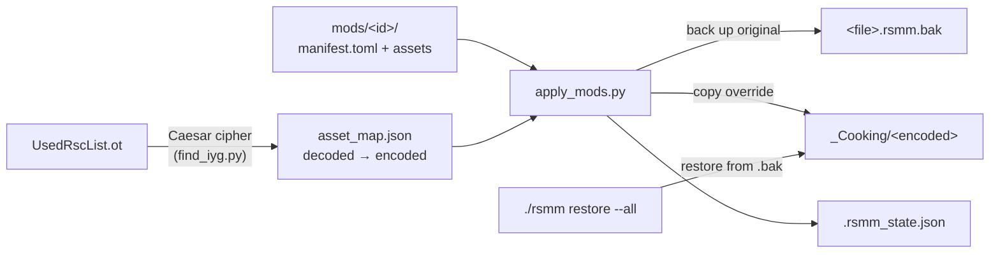

:::note
Where this document mentions `tools/<script>.py`, the current location is
`src/rsmm/cli/<script>.py` or `src/rsmm/engine/<script>.py`; the CLI
surface is `./rsmm <name>`. See also [SETUP.md](/contributing/setup/) for the repo
layout.
:::

## Threat model / scope

Two goals, in priority order:

1. **Don't break the game.** Mod application must be deterministic and
   fully reversible.
2. **Don't fight anti-tamper.** Ravenswatch.exe has anti-tamper logic
   that crashes on common DLL-injection hook points (CreateFileW, Wine
   forwarder patches, etc). v1 avoids the runtime path entirely.
3. **Treat a downloaded mod as hostile input.** A mod archive comes from
   a third party over the network. It must not be able to write outside
   `mods/`, delete anything, ship an executable, or exhaust the disk.

### Untrusted archives

Everything that unpacks a downloaded mod — `rsmm install`, `rsmm update`
and the desktop bridge's `json install-mod` — goes through one extractor,
`rsmm.sdk.archive`. It was previously three separate copies that had
drifted apart, which is why the rules now live in a single module:

| Guard | What it stops |
|-------|---------------|
| Component-wise containment check (`is_relative_to`, not `startswith`) | Zip-slip, including escapes into a sibling dir sharing the prefix (`mods/` → `mods-evil/`) |
| Members read with `ZipFile.open` and written as regular files | A symlink member becoming a real symlink that a later member writes through |
| `safe_dir_name` on every id/slug joined onto `mods/` | An archive whose members all start with `../` yielding the mod id `..`, which `--force` then deletes |
| Entry count / uncompressed size / compression-ratio caps | Decompression bombs |
| `DANGEROUS_EXTENSIONS` refusal | Mods shipping `.exe` / `.dll` / `.ps1` / `.sh` payloads |
| Staged unpack + swap into place | A corrupt or rejected download destroying a working install as a side effect of failing |

Transport is https-only (`file://`, and plain HTTP against loopback, are
allowed for offline installs and local development). Downloads are size
capped and time bounded. Integrity is SHA-256 from `repo.json` plus an
optional Ed25519 signature — see `rsmm.sdk.repo`.

## How v1 works

The engine loads every cooked asset from
`<install>/DarkTalesResources/_Cooking/<encoded>`. `<encoded>` is the
asset's filename run through a fixed Caesar substitution cipher (decoder:
`tools/find_iyg.py`). The cooked bytes have no checksum, signature, or
embedded path; any byte-compatible file at the encoded path is accepted.

Therefore v1 is purely an *install-time file applier*:

1. `tools/find_iyg.py` builds the `encoded -> decoded` map by walking
   `DarkTalesResources/UsedRscList.ot` and applying the cipher.
2. `tools/apply_mods.py` walks `mods/`, parses each manifest, collects
   override files, and resolves each decoded path to its encoded path.
3. For each new override: back up the original cooked file to
   `<file>.rsmm.bak`, copy the mod's file into place.
4. For each previously-active override no longer wanted: restore from
   `.rsmm.bak`, delete the backup.
5. State persists in
   `<install>/DarkTalesResources/_Cooking/.rsmm_state.json`.



No DLL is loaded into the game process. No engine API is hooked. No
anti-tamper code path runs. Removing the manager is `--restore-all`.

## Mod format

```
mods/<id>/
  manifest.toml
  assets/
    <decoded path>/<file>      e.g. Ui/BookMenu/Heroes/UI_HeroPortrait_Romeo_Active.png.Texture.dxt
```

```toml
[mod]
id          = "..."
name        = "..."
version     = "..."
author      = "..."
description = "..."
enabled     = true
```

## State + backups

```
DarkTalesResources/_Cooking/.rsmm_state.json
{
  "version": 1,
  "active": {
    "<encoded path>": {
      "mod":       "<mod id>",
      "src_sha1":  "<sha1 of mod file>",
      "orig_sha1": "<sha1 of original cooked file>"
    },
    ...
  }
}
```

Backups live next to their originals as `<file>.rsmm.bak`. The applier
diffs the wanted set against the active set on every run; a no-op run is
a no-op.

## Asset map

`asset_map.json` is generated by `tools/find_iyg.py`. The cipher is in
that script (`LOWER`, `UPPER`, `SYMBOLS` tables). Confirmed clean as of
2026-05-14: 40,687 paths, no inconsistencies. Regenerate after a game
update if `UsedRscList.ot` changes.

## What v1 cannot do

- **Edit top-level uncooked files** (ApplicationSettings.ot,
  EngineSettings.ini, UsedRscList.ot). These are loaded from outside
  `_Cooking/` and are special-cased by the engine; v1 doesn't manage
  them. Manual edits work, no tooling around them yet.
- **Add new entities, abilities, balance tweaks** that require a *new*
  cooked file with new internal structure. Cooked `.gen` files are
  positionally serialized against per-class schemas that live inside
  `Ravenswatch.exe`. Building one from scratch needs the text-`.ot`
  -> binary-`.gen` re-encoder (research, not built).
- **Toggle mods in-game.** v1 is install-time only.

## v2: in-game UI (research)

The end goal is a Mods entry inside the game's actual book menu, opening
a native-styled mod list. Path forward:

1. `tools/ot_decoder.py` is structural (header + class table + section
   ranges) but does not decode object bodies. Extending it requires the
   per-class serialization schemas. Best Rosetta we have:
   `ApplicationSettings.ot` (text) and the 523 `*.UsedRscCache.ot` files
   (per-asset cooking-pipeline manifests with plaintext bucket / path /
   root-class triples).
2. Build a text-`.ot` -> binary-`.gen` re-encoder, round-trip a known
   simple file (e.g. one of the 224-byte `EnemyCampDifficultyDefinition`
   files: two floats, that's the whole body).
3. Modify the MainMenu cooked asset
   (`_Cooking/Oi/KgxqJdv/HgdzHqzw.lqkql.ri.KgxqFiuqgx.yqz`,
   decoded `Ot/GameUis/MainMenu.level.ot.GameStream.gen`). The menu is
   an `oCGameStream` containing one `BOOK_SPAWNER` referencing
   `Book_Menu\Book_Mesh_Controller.entity.ot`. The actual tab/page
   logic lives in `Book_Mesh_Controller`, which contains
   `oCDtEntityCpnt3DBookControllerSettings` and 74 other classes.
4. Inject a "Mods" tab entry; route the click event back into either an
   external manager or (further out) a DLL we re-introduce once we have
   a viable injection path that survives anti-tamper.

See `FINDINGS.md` for the full reverse-engineering record.

## Parked subsystems

The repo also contains:

- `loader/` — winhttp.dll proxy + MinHook plumbing for in-process hooks.
  Built, but disabled by default. Anti-tamper crashes both the IO hook
  (`CreateFileW`) and the Vulkan present hook on this title.
- `layer/` — Vulkan implicit layer that surfaces an ImGui overlay
  without in-process hooks. Builds, but pressure-vessel strips
  `VK_LAYER_PATH` so the user must drop the manifest into
  `~/.local/share/vulkan/implicit_layer.d/`. Gated by `RSMM_OVERLAY=1`
  via `enable_environment` in the layer manifest.

Both are kept for the v2 work but are not part of the v1 pipeline.
