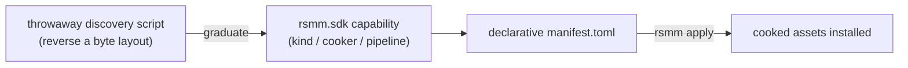

The central RSMM rule, and the biggest departure from Minecraft modding:

> **A mod's deliverable is data — a `manifest.toml` plus assets the SDK emits
> — never a bespoke script.**

This is the data-pack / datagen philosophy taken all the way. Minecraft splits
mods into "code mods" (Forge/Fabric jars) and "data packs"; RSMM aims to make
*everything* expressible as data, with scripted behaviour as the narrow
exception (Lua via the loader).

## What this means in practice

- A finished mod is a `manifest.toml` with `[[content]]` / `[[patch]]` blocks
  plus cooked assets — produced by `rsmm apply`, not by a script you ship.
- One-off Python to reverse a byte layout is fine as throwaway **discovery**,
  but the capability must then graduate into `rsmm.sdk` (a kind builder, an
  engine cooker, or the apply pipeline) and the mod re-expressed declaratively.
- `rsmm lint` enforces this: any `*.py` in a mod that isn't a sanctioned
  lifecycle hook (e.g. `on_disable.py`) fails CI.

:::tip[Why bother]
Declarative mods are inspectable, mergeable (two mods can `[[patch]]` the same
file), survive game updates better, and don't run arbitrary code on a user's
machine at install time. The full custom-item pipeline already lives in the
SDK end-to-end, so a new item is *manifest + `rsmm apply`* with no script.
:::

## Common problems

:::caution
- **`rsmm lint` fails on a `.py` in my mod.** Move the logic into the SDK and
  delete the script, or rename it to a sanctioned hook if it truly is one.
- **"But I need custom behaviour at runtime."** That's the loader's job:
  Lua + the [event bus / symbol map](/concepts/mappings/), not a Python file
  in the mod.
:::

See [Authoring mods](/guides/modding/) and the
[SDK design notes](/guides/sdk/).
