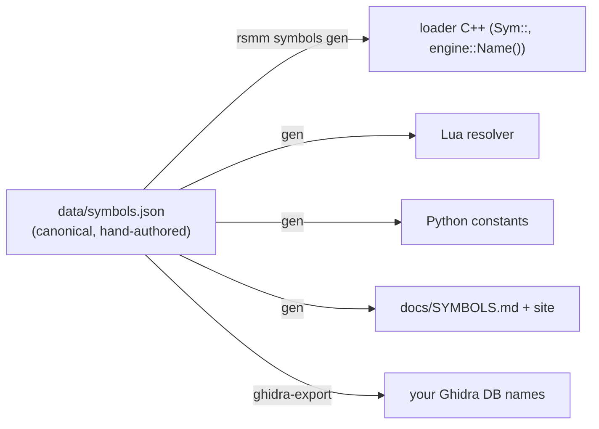

Disassemble `Ravenswatch.exe` and every function reads as `FUN_140xxxxxxx`.
RSMM's **symbol map** (`data/symbols.json`) is the canonical, human-authored
map from semantic names (`MagicalObject_SpawnAllObjects`) to those engine
functions, globals, and events. It is exactly the role Yarn / MCP / Mojang
mappings play for Minecraft.

## Why it survives game updates

Minecraft mappings break when names change between versions; RSMM resolves by
**byte pattern**, not fixed address — like a Mixin refmap that re-finds its
target. Each symbol's `status` tells you how solid it is:

| Status | Meaning |
|---|---|
| `ok` | Resolvable now by byte pattern (survives updates) |
| `va` | Base-relative absolute address (data globals) |
| `unverified` | Documented in an older corpus, address not re-confirmed |

Resolution forms, most to least version-resilient: **raw** (byte pattern),
**anchor** (parent pattern + offset for inlined routines), **va**
(base-relative absolute).

## Layers built on top

Like Forge/Fabric build APIs over mappings, RSMM generates:

- **Typed calls** — a symbol with a `cabi` gets `engine::Name(...)` in C++
  and a Lua resolver entry (the Access-Transformer analog).
- **Event bus** — `kind="event"` symbols generate `R.on("<lua_event>", cb)`
  hooks (the Mixin analog).
- **High-level Lua** — `R.engine.resolve(name)` / `R.engine.call(name, …)`.

:::note[Don't hardcode addresses]
Add a symbol and reference `Sym::Name` / `ADDR["Name"]` instead of baking an
address into the loader or SDK. To stop functions reading as `FUN_xxxxxxxx`
in your own Ghidra, run `rsmm symbols ghidra-export`.
:::

Full generated table: [Engine symbol reference](/reference/symbols/).
