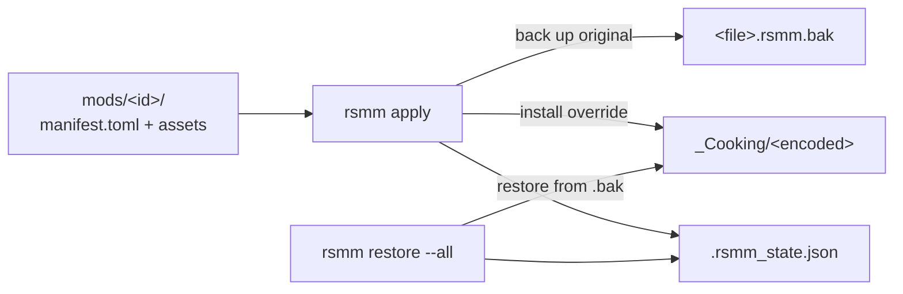

RSMM is, at its core, a reversible **install-time file applier**. Knowing the
lifecycle explains why mods are safe to add and remove at will.

## The stages

1. **Stage** — you author a mod under `mods/<id>/` (a `manifest.toml` plus
   assets). The SDK can emit cooked assets for you; see
   [Mods ship data, not code](/concepts/data-not-code/).
2. **Apply** — `rsmm apply` resolves each decoded asset path to its encoded
   cooked path, backs the original up as `<file>.rsmm.bak`, then copies the
   override into place. The applier is transactional.
3. **Track** — active overrides are recorded in
   `<install>/DarkTalesResources/_Cooking/.rsmm_state.json`.
4. **Restore** — `rsmm restore --all` copies every `.rsmm.bak` back and
   deletes the backups, returning the game to vanilla.

:::note[Why this is safe]
The engine accepts any byte-compatible file at the encoded path — no
checksum, signature, or embedded path. RSMM never patches `Ravenswatch.exe`
and loads no DLL for asset mods, so no anti-tamper code path runs. Full
threat model: [Architecture overview](/architecture/overview/).
:::

## Common problems

:::caution
- **Game updated and a mod vanished.** A patch re-cooked the file your
  override replaced; re-run `rsmm apply`. Backups are per-file, so this is
  safe.
- **Leftover `.rsmm.bak` files.** Means a restore was interrupted. Run
  `rsmm restore --all` again — it is idempotent.
- **`apply` reports a path it can't resolve.** Your `decoded_path` isn't in
  `data/asset_map.json`; check the exact path (forward slashes) against the
  [glossary](/reference/glossary/) entry for `asset_map.json`.
:::
