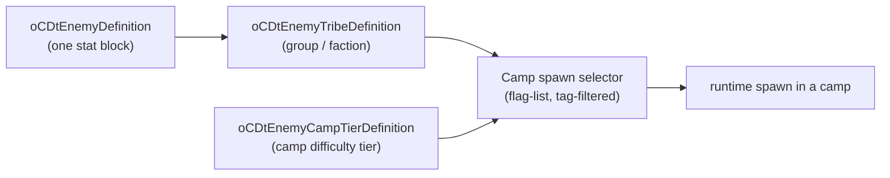

import { Aside, Badge, Steps, LinkCard, CardGrid } from '@astrojs/starlight/components';

Custom enemies are a **clone-and-patch** kind: you start from a vanilla enemy,
change its stats/assets, and register it as a new definition. <Badge text="Confirmed" variant="success" />

<Aside type="tip" title="Proven in game (2026-09-24)">
A clone spawns in real camps: a Gnolls-tribe clone wearing a Mud Crab body
appeared in Storm Island gnoll camps. The def joins its tribe's roster when it
loads, and camps pick from that roster. Keep the clone's **tribe** set to one
the target biome's camps use. Keep its **body** (`entity`) to a creature that
biome streams. Leave **`power`** near vanilla: it is the enemy's cost against
the camp's power budget, not its spawn odds, and a clone priced above the budget
is never picked.
</Aside>

## Author one

The enemy kind is confirmed, so no `experimental` opt-in is needed.

```python title="build.py"
from rsmm import sdk

with sdk.Mod("MyEnemies") as mod:
    mod.enemy(
        "Frost_Goblin",
        base="Goblins/Goblin_Warrior",   # vanilla donor to clone
        name="Frost Goblin",
        # **fields override stat-block values on the clone
    )
```

Equivalent declarative form:

```toml title="mods/MyEnemies/manifest.toml"
[mod]
id = "MyEnemies"

[[content]]
kind = "enemy"
id   = "Frost_Goblin"
base = "Goblins/Goblin_Warrior"
name = "Frost Goblin"
```

`Mod.boss(...)` takes the same shape. Bosses are **not** a separate class — they
are ordinary enemies tagged into the boss flag-list and gated by the boss-timer
controller.

Run `./rsmm apply` to cook and register the definition.

## How enemies spawn

Spawning is **selector-driven**, not a direct "place enemy X" call. The chain:



An enemy reaches a run by being a member of a **tribe**, which a **camp
selector** picks via tags/flags at the right difficulty tier. So registering a
definition is necessary but not sufficient — something must select it.

<Aside type="note" title="Known scaffold bug">
The early scaffold patched the *tribe definition* directly (`tribe_patch`) to
inject the new enemy. That's the wrong layer — selection happens through the
flag-list selector, not the tribe table. The open task is confirming the
selector resolves the new enemy from the runtime library, then driving the
membership from there.
</Aside>

### Class map

The full camp/enemy machinery, for when you need the internals:

| Class | UID | Library | Purpose |
|---|---|---|---|
| `oCDtEnemyDefinition` | `0x176debb7` | `0x1414118c0` | one enemy stat block |
| `oCDtEnemyTribeDefinition` | — | `0x141411200` | tribe = group / faction |
| `oCDtEnemyCampTierDefinition` | `0x176e18f8` | `0x141411560` | difficulty tier of one camp |
| `oCDtEnemyCampDifficultyDefinition` | — | `0x141411710` | global difficulty curve |
| `oCDtEnemyCampEntitySelectorToSpawnEntityCpntSettings` | `0x16b7d175` | — | per-camp spawn selector |
| `oCDtEnemyCampEntitySelectorToSpawnTribeEntrySettings` | `0x16b81d80` | — | one tribe entry inside a camp |
| `oCDtEnemyFlagListEntitySelectorToSpawnEntityCpntSettings` | `0x17019bf9` | — | tag-filtered enemy selector |

`oCDtEnemyDefinition` is fully registered (size `0x350`, factory `FUN_14030a190`).
The runtime spawn primitive itself — the `vftable[3]` call that constructs an
entity at a position — is documented in [Spawning](/reverse-engineering/spawning/).

## Going deeper

<CardGrid>
  <LinkCard title="Spawning (RE)" href="/reverse-engineering/spawning/" description="The engine's runtime entity-creation primitive." />
  <LinkCard title="Mod hooks (RE)" href="/reverse-engineering/mod-hooks/" description="Enemies, bosses, and the level-load pipeline." />
  <LinkCard title="SDK: Mod.enemy" href="/reference/sdk-api/builder/" description="Generated API reference for the enemy builder." />
  <LinkCard title="Authoring mods" href="/guides/modding/" description="The full content-kind authoring guide." />
</CardGrid>
