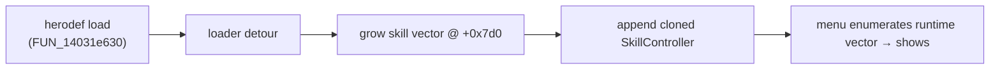

import { Aside, Badge, Steps, LinkCard, CardGrid } from '@astrojs/starlight/components';

A hero's **skills** are the talents on the level-up cards and in the Skill Menu.
The `skill` kind makes a custom talent **visible** by overriding the per-hero
text bank, and can optionally edit the hero definition's skill list. <Badge text="Guess" variant="caution" />

<Aside type="caution" title="What works today">
**`mode="relabel"` works now** — it overrides an existing skill's display text
(name + description) in place, so your talent shows on that skill's real card and
menu slot. Count-neutral and reliable.

Adding a **net-new** skill row is **not** feasible by data edit: `mode="clone"`
is disabled because byte-splicing a row into the herodef bricks the hero (proven
in-game, twice, GUID-independent — the skill collection is structurally
validated by the deserialiser). Net-new skills need the loader's
**runtime-injection** path instead (see [below](#net-new-skills-runtime-injection)).
</Aside>

## Author one

`skill` is a `guess` kind, so the mod must opt in with `Mod(experimental=True)`
(lint enforces this for non-confirmed kinds).

```python title="build.py"
from rsmm import sdk

with sdk.Mod("MySkills", experimental=True) as mod:
    mod.skill(
        "rsmm_lightning_dash",
        hero="Aladdin",
        source="Attack Dive",        # an existing skill to repurpose
        name="Lightning Dash",       # shown on the card / menu
        description="A dash that crackles with lightning.",
        # mode="relabel" is the default
    )
```

Equivalent declarative form:

```toml title="mods/MySkills/manifest.toml"
[mod]
id = "MySkills"
experimental = true

[[content]]
kind        = "skill"
id          = "rsmm_lightning_dash"
hero        = "Aladdin"
source      = "Attack Dive"
name        = "Lightning Dash"
description = "A dash that crackles with lightning."
mode        = "relabel"
```

Run `./rsmm apply` to write the text override into the live install. The display
name resolves against the hero's text bank, so **apply must see a Ravenswatch
install** — `emit` errors out if no install is reachable.

<Aside type="note" title="Identifying a source skill">
`source` accepts either the skill's controller suffix (`Attack Dive`) or its
text-key base (`Skill_Attack_Dive`). The two name the same row.
</Aside>

## Modes

| `mode` | What it edits | Status | Use it for |
|---|---|---|---|
| `relabel` *(default)* | Hero text bank values only (`Skill_<src>_Name` / `_Desc`) | **Works** — visible & count-neutral | Repurposing an existing talent's name/description |
| `repoint` | Herodef row + text values: remints the source row's identity GUID in place | Experimental | Giving an existing skill a fresh identity for behaviour binding |
| `clone` | Would add a NET-NEW herodef row + appended text key | **Disabled** — bricks the hero | (blocked — use runtime injection) |

## Bind behaviour

Relabelling changes only the **text**. To make the talent *do* something custom,
bind logic in a loader Lua script keyed on the talent's identity:

```lua title="mods/MySkills/scripts/lightning_dash.lua"
R.talent.on_pick("rsmm_lightning_dash", function(ctx)
  -- runs when this talent card is picked
end)

-- or define on a hero:
R.talent.define{ hero = "Aladdin", pickable = true, on_pick = function(ctx) ... end }
```

Behaviour binds on `POWER_UP_COLLECT_REQUEST` via the gameplay event bus — it
does not require any herodef edit. See [Mod hooks](/reverse-engineering/mod-hooks/)
for the identity-offset details.

## Net-new skills (runtime injection)

Because a data-cloned row bricks the hero, a genuinely **additive** skill is
added at runtime by the loader, the same way custom items grow the item pool:



The hook (`hook_skills.cpp`) is **default read-only**: it logs the live herodef
and skill-vector count/cap so the layout can be confirmed in-game. The injection
itself is gated behind `RSMM_ENABLE_SKILL_INJECT` and currently clones the last
skill into a spare slot as a proof-of-path (self-guarded: no realloc, count
bounds-checked). Growing the vector with a *distinct* controller and refcounting
it is the open work.

<Aside type="caution" title="Loader env flags">
Never put injection flags in your permanent launch options. The working launch
string and the flag's failure modes are documented in
[Mod hooks](/reverse-engineering/mod-hooks/).
</Aside>

## How a skill is wired

| Layer | Where | Purpose |
|---|---|---|
| Display name / desc | `Text/Hero_<Hero>_Common~GAM.xls.LocalText.gen`, keys `Skill_<Suffix>_Name` / `_Desc` | What the player reads on the card / menu |
| Skill row (identity) | `Definitions/Heroes/<Hero>.herodef.ot.DtHeroDefinition.gen` | The list of skills the hero owns + each row's GUID |
| Behaviour | gameplay event bus (`POWER_UP_COLLECT_REQUEST`) | Custom code on pick |
| Net-new row | loader `hook_skills.cpp`, herodef skill vector `@ +0x7d0` | Adds a slot the deserialiser never validates |

The herodef deserialiser (`FUN_14031e630`) is a strict **versioned, ordered**
field reader: the skill collection's count sits behind a polymorphic header, so a
spliced row desyncs every later field read — which is why data-clone is disabled
and runtime injection is the correct layer.

## Going deeper

<CardGrid>
  <LinkCard title="Skills system (RE)" href="/reverse-engineering/skills-system/" description="How skills are stored, the crash mechanism, and the grid-layout wall." />
  <LinkCard title="Mod hooks (RE)" href="/reverse-engineering/mod-hooks/" description="The loader detours, env flags, and skill-injection path." />
  <LinkCard title="Custom enemies" href="/guides/custom-enemies/" description="The other clone-and-patch content kind." />
  <LinkCard title="SDK: Mod.skill" href="/reference/sdk-api/builder/" description="Generated API reference for the skill builder." />
  <LinkCard title="Authoring mods" href="/guides/modding/" description="The full content-kind authoring guide." />
</CardGrid>
