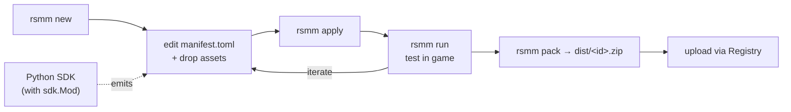

This is the **single** authoring guide — scaffolding a mod through shipping a
finished `.zip`. For CLI command details, see the [CLI Reference](/reference/cli/);
for the SDK design rationale, [SDK_V3.md](/guides/sdk/).



> **One output, two ways to produce it.** Every mod ships the *same* thing: a
> declarative `manifest.toml` (`[[content]]` / `[[patch]]`) plus assets. You can
> hand-write that TOML, **or** generate it with the typed Python SDK
> (`with sdk.Mod(...)`) — the SDK is an author-time *generator* that emits the
> manifest for you (validated, with handles/tags/an offline testkit). Your
> `build.py` is a tool you run; it is **not** shipped inside the mod. See
> [Authoring with the Python SDK](#authoring-with-the-python-sdk) below.

> **A mod is data, not code.** The shipped artifact is `manifest.toml` + assets
> — never an arbitrary python script dropped in the mod folder. Reversing a byte
> layout with a throwaway script is fine for *discovery*, but fold the capability
> into `rsmm.sdk` and express the mod declaratively before shipping. `rsmm lint`
> (and CI) rejects any `*.py` in a mod except the sanctioned `on_disable.py`
> lifecycle hook. (The SDK `build.py` lives in the mod source but is a generator,
> not loaded at runtime; `init.lua` is the one sanctioned in-mod runtime script.)

---

## Quick start

```sh
# Scaffold a mod
./rsmm new MyMod

# Verify it's healthy
./rsmm doctor

# Install into the game
./rsmm apply

# Launch the game
./rsmm run

# Iterate with auto-reapply
./rsmm watch              # runs in background; reapplies on every change

# Roll back when done
./rsmm restore --all

# Package for sharing
./rsmm pack MyMod         # writes dist/MyMod.zip
```

---

## Two override strategies

Independent of *how* you produce the manifest (hand-written TOML or the
[Python SDK](#authoring-with-the-python-sdk)), a mod changes the game in one of
two ways:

### 1. Drop cooked files (raw)

Mirror decoded paths under `assets/`. Full control, byte-for-byte. One mod owns each file.

### 2. Compose `[[patch]]` blocks (recommended)

Write declarative blocks in `manifest.toml` for stats, text, URLs, and textures. The applier composes every mod's patches into a single cooked file per target. Two mods touching *different* fields of the same file both take effect; conflicts on the *same* field resolve by `load_order` (lower = applies first; later wins on overlap).

Example using the Python SDK:

```python
# mods/MyMod/build.py
from rsmm import sdk

with sdk.Mod("MyMod", author="me", load_order=50) as m:
    m.stat("Bleed_Duration_Value", value=10)
    m.stat("Easy", min=5, max=10)
    m.text("Common", lang="EN", key="Menu_Discord", value="Mods")
    m.url("DiscordUrl", "https://example.com")
    m.texture("hero.romeo.portrait_active",
              donor="hero.sunwukong.portrait_active")
```

Run `python3 mods/MyMod/build.py` to emit `manifest.toml`. Friendly aliases (`hero.<name>.portrait_<state>`) hide the cooked-path lookups.

---

## Mod layout

```
mods/MyMod/
    manifest.toml              # Required: id, name, version, author
    assets/                    # Mirrors decoded paths from data/asset_map.csv
        <decoded-path>/<file>
    _root/                     # Optional: top-level overrides (outside _Cooking/)
        DarkTalesResources/
            ApplicationSettings.ot
    init.lua                   # Optional: Lua script run by the loader DLL
    build.py                   # Optional: Python SDK build script
    on_disable.py              # Optional: cleanup hook when mod is disabled
```

### manifest.toml

```toml
[mod]
id          = "MyMod"
name        = "My Mod"
version     = "1.0.0"
author      = "you"
description = "what it does"
enabled     = true
```

### on_disable.py (optional)

Place next to `manifest.toml`. Fires from `./rsmm apply` when the mod flips `enabled = true → false`. Subprocess with 30s timeout; receives `RSMM_GAME_DIR`, `RSMM_COOKING`, `RSMM_MOD_DIR` env vars.

Use for cleanup the loader DLL can't do at apply time — clearing settings keys, deleting profile caches, etc.

See `mods/ExampleSeedPin/on_disable.py` for a canonical example.

### ConsoleRuntime / dev_mode

The bundled `mods/ConsoleRuntime/` mod ships with a `dev_mode` flag in its `manifest.toml`. Off by default. When `dev_mode = true`, ConsoleRuntime registers `/eval`, which executes arbitrary Lua inside the game process.

Toggle: edit `mods/ConsoleRuntime/manifest.toml`, set `dev_mode = true`, then `./rsmm apply` (or relaunch the game). Never ship a release with it on.

---

## Authoring with the Python SDK

The recommended way to *produce* a mod's `manifest.toml`. You describe the mod
in Python; `rsmm.sdk` writes the `mods/<id>/` tree atomically. Typed builders,
cross-mod handles/tags, and an offline testkit make it harder to ship a broken
manifest by hand. Design rationale: [SDK_V3.md](/guides/sdk/).

### First mod

A mod is a `with sdk.Mod(...) as m:` block — calls accumulate in memory and the
tree is written when the block exits.

```python
# mods/FrostPack/build.py
from rsmm import sdk

with sdk.Mod("FrostPack", version="1.0.0", author="you", name="Frost Pack") as m:
    m.i18n("EN", {"FrostPack_hello": "A chill wind blows."})
```

```bash
python mods/FrostPack/build.py   # writes mods/FrostPack/manifest.toml + assets
rsmm list                        # see it registered
rsmm apply                       # install into the game
```

### Typed content + handles

`m.item / m.enemy / m.boss / m.map / m.hero` clone a vanilla **base** and return
a `ContentRef` (like Forge's `RegistryObject`). Pass a handle anywhere another
content id is expected — it resolves to the raw id automatically. Find valid
bases with `rsmm schema [kind] [--grep T]`.

```python
with sdk.Mod("FrostPack", version="1.0.0", author="you",
             experimental=True) as m:           # required for non-confirmed kinds
    blade = m.item("FrostBlade", base="Orb_Grants_Strength", name="Frost Blade")
    m.enemy("FrostGhoul", base="Marsh_Ghoul", add_flags=["Elite"])
    m.boss("IceLord", base="Baba_Yaga_Boss", drops=[blade])   # ref -> id
```

> Only `item` + `talent` are ✅ confirmed; the rest are ⚠️/❓ and need
> `experimental=True`. See [Content kinds & confidence](#content-kinds--confidence).

### Tags, assets, config

```python
m.tag("daggers", [blade, "VanillaKnife"])     # append-across-mods set; R.tags() in Lua
m.texture("3D/.../T_Melusine_ALB.png", "art/albedo.png")    # PNG/DDS/TGA, auto-cooked
m.skinpack("Crimson Pack", key=0x900001)                    # new selectable slot (experimental)
m.config({"fields": {"frost_damage": {"type": "float", "default": 1.5}}})
m.i18n("FR", {"FrostBlade_desc": "Gèle à l'impact."})
print(m.summary())                            # dict of everything staged, no disk write
```

### Test offline (no game)

`rsmm.sdk.testkit` asserts over staged state without applying:

```python
from rsmm import sdk
from rsmm.sdk.testkit import expect, assert_no_conflicts

def build():
    m = sdk.builder.ModBuilder("FrostPack", version="1.0.0", author="you")
    blade = m.item("FrostBlade", base="Orb_Grants_Strength", name="Frost Blade")
    m.tag("daggers", [blade]); m.i18n("EN", {"FrostBlade_desc": "Freezes."})
    return m

def test_frostpack():
    (expect(build())
        .has_item("FrostBlade").has_tag("daggers", "FrostBlade")
        .i18n_complete().clean())          # every locale key present, no warnings

def test_no_clashes():
    assert_no_conflicts(build())           # safe alongside itself
```

### SDK quick reference

| Goal | Call / command |
|------|----------------|
| New content (handle) | `m.item/enemy/boss/map/hero(id, base=…)` |
| Find base ids | `rsmm schema [kind] [--grep T]` |
| Group content | `m.tag(id, [refs…])` |
| Override asset | `m.texture/model/asset(decoded, src)` |
| New skin slot | `m.skinpack(name, key=…)` |
| Config / strings | `m.config({...})` / `m.i18n(loc, {...})` |
| Preview staged state | `m.summary()` |
| Offline assertions | `from rsmm.sdk.testkit import expect, assert_no_conflicts` |
| Generated API docs | `rsmm docs-gen` → [`docs/api/`](/) |

---

## Recipes

### Replace a cooked file (raw)

```sh
# Find the decoded path:
rg -i "hero.*portrait" data/asset_map.csv

# Copy your file in:
cp /path/to/donor.dxt \
   mods/MyMod/assets/Ui/BookMenu/Heroes/UI_HeroPortrait_Romeo_Active.png.Texture.dxt

# Apply
./rsmm apply
```

### Texture swap (donor reference)

```sh
./rsmm texture --list --grep Hero_Romeo
./rsmm texture --mod-id RomeoIsMonkey \
    'Ui/BookMenu/Heroes/UI_HeroPortrait_Romeo_Active.png.Texture.dxt=Ui/BookMenu/Heroes/UI_HeroPortrait_SunWukong_Active.png.Texture.dxt'
./rsmm apply
```

Donor-swap only. PNG → cooked texture cooker needs the `oCTexture` container RE'd (see [Roadmap](/project/roadmap/)).

### Numeric balance / modifier / camp difficulty

```sh
./rsmm stat --list                    # See all available stats
./rsmm stat --list --grep Bleed       # Search
./rsmm stat --mod-id LongerStatusEffects \
    Bleed_Duration_Value=10 \
    Ignite_Duration_Value=11 \
    Easy:min=5 Easy:max=10
./rsmm apply
```

### Magical-object & talent values (`value_patches`)

Edit the numbers inside a magical object or a hero talent ("Skill"). Discover
the editable labels + defaults first, then declare the edits in `manifest.toml`:

```sh
./rsmm items show Damage_Power      # item value fields (+ [shadowed] markers)
./rsmm talents Juliet               # hero talent values (+ [shadowed/no-op])
```

```toml
# Item: clone a vanilla magical object with patched values
[[content]]
kind = "item"
id   = "MyStrongerPower"
base = "Damage_Power"
value_patches = [
    ["Power Crit Chance Value", 0.4, 0.1],
    # A shadowed value (see below) needs clear_override to take effect:
    { label = "Damage Value", old = 0.2, new = 0.5, clear_override = true },
]

# Talent: patch a hero's cooked entity in place (plain override, no clone)
[[content]]
kind = "talent"
hero = "Juliet"
id   = "JulietBuff"
value_patches = [["Primary Ability Rose Explosion Damage Value", 8.0, 24.0]]
```

**Shadowed values.** Some value nodes don't use their inline number — the game
reads the value from a selector/curve (e.g. card-count scaling), so editing the
inline float is a silent no-op. `rsmm items show` / `rsmm talents` tag these
`[shadowed]`, and `apply` **errors** if you patch one without
`clear_override = true`. Clearing the override makes the inline number
authoritative but unbinds the selector — e.g. per-card-stack scaling becomes a
flat value. That trade-off is intentional; pick the flat number you want.

### Translation strings

```sh
./rsmm text --list Common --lang EN
./rsmm text --list Common --grep Menu_
./rsmm text --mod-id Relabel 'Common~EN:Menu_Discord=Mods'
./rsmm apply
```

Languages: `EN JA KO RU ES DE PL FR IT PT-BR ZH-S ZH-T RO`.

### Main-menu URLs

```sh
./rsmm url --list
./rsmm url --mod-id MyHub DiscordUrl=https://my-mods-site.example/
./rsmm apply
```

### In-game UI tweaks

```sh
./rsmm menu-button        # Add a "Mods" entry to the title menu
./rsmm social-tab         # Add a Mods tab to the in-game Social book
./rsmm mods-list          # Ship a Mods_List entity for the social tab
```

### Lua-scripted mod

The loader DLL (`dist/winhttp.dll`) runs `init.lua` once per launch in a sandboxed `lua_State` per mod.

```sh
./rsmm install-loader     # Copy the DLL into the game install
```

Add to Steam launch options: `WINEDLLOVERRIDES="winhttp=n,b" %command%`.

Lua API exposed to mods:

```lua
-- Runtime
rsmm.log(msg)
rsmm.mod_dir()                       -- this mod's directory
rsmm.game_dir()                      -- absolute install dir
rsmm.is_in_main_menu()               -- bool
rsmm.list_mods()                     -- {id, name, version, author, enabled}[]
rsmm.encoded_path(decoded)           -- decoded -> encoded path
rsmm.decoded_path(encoded)           -- encoded -> decoded path
rsmm.register_asset_override(decoded, src_abs_path)
rsmm.commit()                        -- apply registered overrides
rsmm.on_event(name, fn)              -- "ready" | "exit"

-- Game function access (53k functions resolvable by name)
rsmm.resolve(name)                   -- "FUN_xxx" -> runtime VA
rsmm.call(target, "sig", ...)        -- invoke by signature
rsmm.module_base()                   -- Ravenswatch.exe image base
rsmm.read_u8/u16/u32/u64/f32/f64(va) -- raw memory read
rsmm.read_cstr(va, max)              -- read NUL-terminated string
rsmm.write_u8/u16/u32/u64/f32/f64(va, v)
```

See `mods/ExampleLuaMod/init.lua` and `mods/ExampleSeedPin/init.lua` for working examples. Full game-function API + caveats: [docs/_re/CALLING_GAME_FUNCTIONS.md](/reverse-engineering/calling-game-functions/).

### Events

`R.on` is the whole surface. Both engine buses are armed by default, so a mod
sees every event the game fires without the user touching launch options.

```lua
local h = R.on("gameplay:GIVE_MAGICAL_OBJECT", function(ev) ... end)
R.on_match("^gameplay:ABILITY_", function(ev, name) ... end)  -- whole family
R.once("run:start", function() ... end)                        -- fire once
R.off(h)                                                       -- unsubscribe
R.emit("mymod:something", { n = 1 })                           -- tell other mods
```

Four sources land on the same bus:

| Source | Names | Notes |
|---|---|---|
| Lifecycle | `setup`, `ready`, `tick`, `exit` | loader thread |
| Analytics firehose | `run_start`, `enemy_killed`, `unlock_hero`, … | after the action, no live handles |
| Gameplay bus | `gameplay:<NAME>` | at the action, live handles, game's MAIN thread |
| Loader-derived | `hero:captured`, `hero:changed`, `hero:lost`, `menu:enter`, `menu:leave`, `run:start`, `run:end` | loader thread |

`ev.source` says which (`"analytics"`, `"gameplay"`, `"loader"`, `"mod"`) — and
it is stamped by the loader, so it can be trusted. **Only `"gameplay"` handlers
run on the game's main thread**; anything else must route engine-mutating work
through `R.schedule.next_main` (see [the thread model](/reverse-engineering/event-systems/)).

**150 gameplay events are catalogued** — mined out of the shipped exe by
`tools/mine_event_names.py` and browsable without launching anything:

```sh
./rsmm symbols events            # all of them, grouped by family
./rsmm symbols events boss       # BOSS_ACTIVATED, BOSS_DEFEATED, …
```

A taste of what's on the bus: `BOSS_DEFEATED`, `OPEN_CHEST`, `HERO_REVIVE`,
`START_NIGHTMARE`, `WISHING_WELL_FILLED`, `USE_HEAL_FOUNTAIN`,
`UPGRADE_RANDOM_SKILL`, `DUPLICATE_RANDOM_EPIC_OBJECT`, `CHOOSE_MELODY`,
`MAP_GENERATION_DONE`, `TELEPORT_SUBMAP_ENTER`, `ENEMY_KILLED`.

The same catalog is available inside the game, plus a live one of everything
that has actually fired:

```lua
R.events.known("gameplay")    -- the 150 static names, before anything fires
R.events.category("BOSS_DEFEATED")   --> "boss"

R.events.list("^gameplay:")   -- sorted names seen THIS session
R.events.count("enemy_killed")
R.events.dump()               -- log every event with its count + payload keys
```

The catalog is a browsing aid, not a whitelist: the loader reads the plaintext
name off the event object, so a name a future patch adds fires too.

### Event payloads

Most events have **no payload** — and that is the engine's design, not a gap
in ours. There are only ~24 `oCGameNamedEvent` subclasses that carry data;
every other name is dispatched as the bare base class, so all it can tell you
is *that it happened*, plus the `dispatcher` / `entity` handles saying to whom.

For the ~24 that do carry data, the layouts are recovered from the binary by
`tools/mine_event_payloads.py` (RTTI → vftable → the code that stores it) and
the loader decodes them by matching the event's **own vftable**, so the match
is exact:

```lua
R.on("gameplay:NETWORK_DAMAGE", function(ev)
    R.log(ev.class)          -- "oCGameNamedEventNetworkDamage"
    R.log(ev.value)          -- 12.5      (f32, hand-confirmed)
    R.log(ev.target_entity)  -- "0x2a1f…" (handles are hex strings: a Lua
end)                         --            number would lose the low bits)
```

Read the field names honestly: **offsets and widths are recovered, meaning is
not.** A field only gets a semantic name (`value`, `target_entity`,
`mo_guid_lo`) where hand-RE confirmed it; everything else is mechanical —
`u50` is "u32 at +0x50", `f6c` is "float at +0x6c". They are real fields at
real offsets, but what they *mean* is for you to pin down.

Two things help with that. `ev.class` tells you which struct you are looking
at, and the `RSMM_EVENT_PROBE` loader flag adds a raw window (`ev.w38 …
ev.w70`) to every gameplay event — so a field gets pinned from Lua in one
session instead of a C++ rebuild per guess.

Decoding is gated on the build fingerprint: vftable addresses are
build-specific, so after a game update the loader falls back to the plain
envelope until the schemas are re-mined
(`python tools/mine_event_payloads.py --verify`).

### Hot-reload (Lua iteration < 5 seconds)

Run `./rsmm watch` in a side terminal while the game runs. On any save under `mods/`:

1. Re-applies cooked overrides.
2. Syncs `manifest.toml` + `init.lua` into the game-dir `mods/<id>/`.
3. The loader polls those files every ~1 second, tears down the changed mod's `lua_State`, and re-runs `init.lua`.

Tweak a number, hit save, see the result in-game without restarting.

Watch the live log:

```sh
./rsmm log -f --grep "lua\|reload"
```

Expected output on a Lua-only edit:

```
[lua] ExampleSeedPin reload (init.lua changed)
[lua] ExampleSeedPin init OK
[SeedPin] forced seed = 12345 (enable=1) after 1 ticks
```

---

## Reading the loader log

The loader writes to `<game>/mods/_log.txt`. Read it from the repo:

```sh
./rsmm log              # Full dump
./rsmm log -n 80        # Last 80 lines
./rsmm log -f           # Follow live (Ctrl-C to stop)
./rsmm log --grep lua   # Filter (case-insensitive)
./rsmm log --clear      # Clear before a fresh launch
```

Lua errors print as `[lua] <mod-id> ...`; `rsmm.log("msg")` calls land in the same file.

---

## Don't ship vanilla bytes

`rsmm pack <id>` hashes every file against the original cooked asset. If any file is byte-identical to the original, pack **refuses** — shipping unmodified game bytes is redistribution of copyrighted game content, not a mod.

```
$ ./rsmm pack MyMod
refusing to pack MyMod: contains files byte-identical to original game assets ...
  assets/Ui/BookMenu/Heroes/UI_HeroPortrait_Romeo_Active.png.Texture.dxt  (matches original cooked asset)
```

Fix: replace the listed files with your own modified bytes. `--allow-vanilla` bypasses the check for personal backup zips only.

The `data/uncooked/` mirror is git-ignored for the same reason — it exists for local reference only (see [Uncooked Assets](/guides/uncooked-assets/)).

---

## Load order

When two mods override the same encoded path, the applier keeps the **later mod by alphabetical id** and warns. Explicit load-order control will come with the in-game UI. If order matters now, encode it: `10_Patch`, `20_Skins`, ...

---

## Content kinds & confidence

Every content kind carries an honesty rating — **how much we trust the bytes
it emits**. The ratings are the single source of truth in
`src/rsmm/sdk/content.py::KIND_CONFIDENCE`; `rsmm lint` and the SDK enforce
them. Don't trust prose over that table — but here it is in plain terms:

| Capability | Rating | Reality |
|---|---|---|
| **Replace a cooked file** (raw / texture / model / stat / text / url patch) | ✅ confirmed | Install-time file replacement. Bread and butter. |
| **PNG → cooked texture** | ✅ confirmed | `engine/cooked_schemas/texture.py` cooks PNG/DDS/TGA into the `oCTexture` container at apply-time. |
| **Custom 3D mesh** (`.glb`/`.gltf`) | ⚠️ experimental | `engine/geometry_cook.py` round-trips and retargets a mesh onto the original's skeleton (≤65535 verts), but in-game render is only partially proven. See `DesertEagleJuliet`. |
| **Custom magic item** (`kind="item"`) | ✅ confirmed | New magical object shows in compendium + drops (verified 2026-06-02). Clone a vanilla `base`, patch values. See `ItemCloneTest`. |
| **Edit talent / item values** (`kind="talent"`, `value_patches`) | ✅ confirmed | In-place magnitude override. See `JulietTalentBuff`. |
| **Reskin an existing hero** (texture/model override) | ✅ confirmed | See `JulietReskin`. |
| **Custom enemy** (`kind="enemy"`) | ⚠️ experimental | Codec round-trips and the def registers, but the in-game spawn-apply step is unproven (flag-list selector resolution unconfirmed). |
| **Custom hero / map** (`kind="hero"`, `kind="map"`) | ⚠️ experimental | Clones and emits, but the roster detour / library singleton (hero) and in-game load (map) are unproven. |
| **Custom boss** (`kind="boss"`) | ❓ guess | Picker/HP/arena byte offsets are speculative. May be rejected or crash. |
| **Reward placement edits** (`kind="reward"`) | ⚠️ experimental | Ban chests/astrolabs/crystals or tune per-category spawn counts by overriding a retail `*.rewarddef.ot`. Codec is deserializer-verified and byte-stable; the level-load roll consuming edited data is unproven in-game. |
| **New selectable skin slot** | ⚠️ experimental | Needs the loader skin detour; the DLC-entitlement filter rejects new keys by default (`RSMM_SKIN_FORCE_SHOW=1` to test). Replacing an existing slot is ✅ confirmed. |
| **Engine event hooks** (`R.on("OnDamage", …)`) | ⚠️ experimental | The event bus + payload envelope ship in the loader, and emitter addresses are mapped — but the runtime path is **not yet verified end-to-end on CI** (loader is Windows-only). Treat as unproven until the loader smoke test (below) is green. |
| **Call any of 53k game functions from Lua** (`R.engine.call`) | ✅ confirmed | Covers seed pinning, stat reads, save inspection, forced option overrides. Interception (hooks) is the experimental part above. |

**Opting into unverified kinds.** Registering any non-`confirmed` kind requires
`sdk.Mod(..., experimental=True)` (and the manifest records `experimental = true`);
otherwise the SDK raises and `rsmm lint` fails. This is deliberate — a ⚠️/❓
kind is a known guess, not a finished feature.

```python
with sdk.Mod("MyEnemyMod", experimental=True) as m:   # required for enemy/boss/hero/map
    m.enemy("Dreadgnoll", base="Gnoll_Shielded", tribe="Gnolls")
```

See [docs/INTERNALS.md](/architecture/internals/) for the engine notes that ground all of the above, and [docs/ROADMAP.md](/project/roadmap/) for open work.

---

## Cooked-file inspector

```sh
./rsmm decode <path-to-cooked-file>       # Structural dump
./rsmm decode <path> --raw                # Include hex payloads
```

Parses the class table + section structure. Won't fully decode per-class property bodies (schemas live in `Ravenswatch.exe`) but prints enough to identify what you'd be modifying.