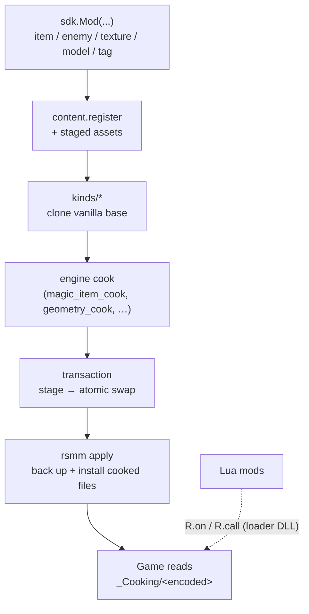

:::note
**This is a design/rationale doc, not a how-to.** To *write a mod*, go to
[MODDING.md](/guides/modding/) and its
[Python SDK section](/guides/modding/#authoring-with-the-python-sdk). This file
explains *why* the SDK is shaped the way it is.

Status: design + scaffold landed (2026-05-19). Schema-mining + TLS-injection
are scaffolded but their RE / native work is open. See "Open work" at the
bottom for what is still empirical.
:::

## Goals

1. **Add new content** — items, enemies, bosses, maps, heroes — declared from a
   mod, materialized as cooked-asset writes by RSMM.
2. **Edit existing content** — every kind above, plus stats, text, URLs, menu
   buttons. Reuse the existing `[[patch]]` merge pipeline.
3. **Open extensibility** — third parties contribute new content kinds, CLI
   subcommands, or runtime services as Python entry-point plugins. Core stays
   stable; ecosystem grows out of tree.
4. **Crash-safe** — apply transaction is atomic; a boot canary detects a crashy
   mod and bisects on next launch; per-mod Lua errors never escape `pcall`.
5. **Programmer freedom** — `R.call` (53k fns), `R.hook` (after TLS injection
   lands), `R.read/write` memory primitives, event bus, scheduler.
6. **Survives game updates** — pattern-resolver already byte-pattern not VA;
   manifests declare `target_game_build`; mods address fns by name; schemas
   are versioned and auto-migrated.
7. **Localization, config, inter-mod APIs** — first-class. Wired through the
   SDK runtime, not bolted on per mod.
8. **Distribution** — open spec (`repo.json`), SHA256 + optional Ed25519
   signature. No central host required.

## Module map

```
src/rsmm/sdk/
  __init__.py         # public Python surface: `from rsmm import sdk; sdk.Mod(...)`
  api.py              # @sdk_export + version pin (rsmm.sdk.api.v1)
  health.py           # apply-canary + crash-history bisect
  transaction.py      # stage -> swap install pipeline
  config.py           # schema-driven per-mod config, generates UI rows
  i18n.py             # lang/<locale>.toml merge into text banks
  content.py          # R.content.register(kind, def) facade
  intermod.py         # R.api.expose / R.api.require
  plugins.py          # entry-point discovery, version-gated load
  repo.py             # repo.json schema + sign/verify (Ed25519)
  versioning.py       # game-build hash check + schema migrations
  kinds/              # one module per content kind
    items.py          # magical objects
    enemies.py
    bosses.py
    maps.py
    heroes.py
    _schema_mining.py # Ghidra-driven class-cohort schema extractor
```

Lua side (loader DLL):

```
src/loader/lib/
  rsmm.lua            # R = require "rsmm" — the core surface (R.on/R.emit,
                      #   R.entity/R.combat/R.stat/R.xp, R.give, R.item,
                      #   R.talent, R.options, R.hook, R.kv, R.debug,
                      #   R.serialize, R.defs, R.rtti) and it merges the
                      #   submodules below onto R
  engine_gen.lua      # GENERATED: semantic name -> {pattern, offset, sig}
src/loader/lua/
  rsmm/health.lua     # R.health (crash count, last_error, checkpoint)
  rsmm/config.lua     # R.config.get/set/on_change
  rsmm/i18n.lua       # R.i18n.t
  rsmm/api.lua        # R.api.expose/require
  rsmm/schedule.lua   # R.schedule.{next_frame, after, next_main, after_main}
```

Both trees are merged into `<game>/rsmm/lib/` by `rsmm install-loader`, which
is why `require "rsmm"` and `require "rsmm.schedule"` both resolve in-game.

`rsmm.lua` is rebuilt by `rsmm build` from the Python side so the Lua API
declarations stay in lockstep with the Python registrations.

How an authored mod becomes installed bytes (declarative all the way down —
no per-mod scripts):



## Manifest v2

```toml
[mod]
id = "MyMod"
name = "My Mod"
version = "1.2.3"             # semver
author = "Me"
description = "..."
enabled = true

sdk_version = ">=3.0,<4"      # required SDK API
target_game_build = "1.2.3"   # what game version it was built for
load_order = 100              # tiebreak ordering
priority   = 0

[dependencies]
otheritempack = ">=1.0"

[provides]
api = "myapi"                 # what `R.api.require("myapi")` resolves to

[[patch]]                     # existing field-merge support
...

[[content]]                   # NEW: declarative content registration
kind   = "item"               # one of: item, enemy, boss, map, hero
id     = "FrostBlade"
source = "content/frost_blade.toml"
```

## Apply transaction

`rsmm apply` becomes two-phase:

1. **Stage**: every write goes to `<cooking>/.rsmm_stage/<encoded>`. Backups
   created next to originals as before. Nothing in `_Cooking/` proper is
   touched yet.
2. **Commit**: atomic rename of staged files into place (POSIX `os.rename`,
   `MoveFileExW` w/ `MOVEFILE_REPLACE_EXISTING` on Windows). On the first
   error mid-commit, every successful rename is rolled back from `.rsmm.bak`.

State writes are also staged. `.rsmm_state.json` is written to
`.rsmm_state.json.tmp` then renamed.

Power-loss safety: `rsmm apply` is restartable — staged-but-uncommitted
files are detected at startup and either committed (if a `COMMIT` marker
exists) or discarded.

## Boot canary

The loader opens a canary in `<game>/mods/_health.json` before any mod code
runs, and stamps a `step` as boot advances:

```
boot -> per_mod:A -> post_init:A -> per_mod:B -> ... -> ready -> boot_ok
```

```json
{
  "version": 1,
  "canary": { "open": true, "step": "per_mod:A", "session": "a3f1" },
  "mods": { "A": { "crashes": 1, "last_error": "...", "disabled": false } }
}
```

The canary is closed (`open: false`) once the tick pump has run for ~2 s past
`ready` — i.e. the game demonstrably survived load. If the NEXT launch finds
it still open, the previous run died at the recorded step, so a crash inside
`per_mod:X` is attributed to mod X and counted.

Three **consecutive** failed boots and the mod is skipped at load
(`disabled: true` with a reason) — you can't reach an in-game UI to turn off
a mod that bricks startup. Any launch that boots successfully resets the
counters. To re-enable, clear the flag in `mods/_health.json`.

## `R.health` API

```lua
R.health.crash_count("modid")   -- consecutive failed boots (default: this mod)
R.health.last_error("modid")    -- string|nil
R.health.disable("modid", "reason")
R.health.checkpoint("step")     -- stamp your own sub-step into the canary
```

## Config

`mods/<id>/config_schema.toml`:

```toml
[fields.damage_mult]
type    = "float"
min     = 0.1
max     = 10.0
default = 1.0
label   = "Damage multiplier"

[fields.enable_effect]
type    = "bool"
default = true
```

`mods/<id>/config.toml` is generated/written by the user via the web UI or
`rsmm config <id> set damage_mult 2.5`. SDK API:

```lua
local cfg = R.config              -- bound to the calling mod
local mult = cfg.get("damage_mult")
cfg.on_change("damage_mult", function(new, old) ... end)
```

Validation errors at write-time → rejected with explicit message.

## i18n

`mods/<id>/lang/<locale>.toml` (a `.json` object of the same key/value pairs
works too):

```toml
[strings]
title  = "Frost Blade"
desc   = "An icy weapon."
```

Locales: `EN, JA, KO, RU, ES, DE, PL, FR, IT, PT-BR, ZH-S, ZH-T` (game's
existing 12 user locales + the `RAW` QA pseudo-locale).

At apply time, RSMM merges strings into per-locale text-bank overrides,
keys namespaced as `RSMM_<modid>_<key>`.

Lua API:

```lua
R.i18n.t("title")               -- "Frost Blade"
R.i18n.t("hello", {name="X"})   -- substitution: "Hello, X"
```

Missing locale → fall back to `EN`. Missing key in `EN` → return the key
literally and log warning.

## Inter-mod API

```lua
-- producer
R.api.expose({
  spawn_item = function(id, pos) ... end,
  version    = "1.0.0",
})

-- consumer
local items = R.api.require("itempack", ">=1.0")
items.spawn_item("FrostBlade", player.pos)
```

`expose` is implicitly namespaced to the calling mod's `id` (override with
`api_name`). `require` checks the producer's `version` against the semver
spec and returns a read-only proxy that `pcall`s every call, so a producer
failure surfaces as an error in the consumer instead of taking it down.

**Calls cross a state boundary.** Every mod runs in its own `lua_State`, so
the proxy marshals through the loader rather than handing over a Lua table
directly. Arguments and return values must therefore be **data** — `nil`,
boolean, number, string, or tables of those. Passing a function (a callback)
is rejected with an error; use an event (`R.on`) for producer → consumer
signalling.

```lua
R.api.has("itempack")       -- bool
R.api.version("itempack")   -- "1.0.0" | nil
R.api.list()                -- { itempack = { mod_id = ..., version = ... } }
```

### Signalling: `R.emit`

`R.api` is the *call* direction. For the other direction — "something
happened, whoever cares should react" — emit an event; every mod's state
receives it.

```lua
-- producer
R.emit("itempack:crafted", { id = "FrostBlade", tier = 3 })

-- any consumer
R.on("itempack:crafted", function(ev)
  R.log(ev.from, "crafted", ev.id)     -- ev.from = the producer's mod id
end)
```

Payloads must be data (they are marshalled between states). The loader
stamps `event`, `source = "mod"` and `from = <mod id>` onto every payload,
**overwriting** whatever you set — that is what stops a mod from
impersonating the gameplay bus, whose `source` field is how `R.schedule`'s
main-thread pump and `R.stat`'s re-assert know they are running on the
game's own thread. For the same reason the loader's own names are refused:
the `gameplay:` / `ui:` / `rsmm:` prefixes and the lifecycle events
(`setup`, `ready`, `tick`, `exit`). Prefix yours with your mod id.

## Plugin registry

Third-party Python packages can register SDK extensions via PEP-621
entry points:

```toml
# their pyproject.toml
[project.entry-points."rsmm.plugins"]
my_pack = "my_pack.entry:register"
```

`register(api)` is called with an `rsmm.sdk.api.v1` namespace and may:

* declare new `R.content` kinds (via `api.content.register_kind(...)`),
* add CLI subcommands (`api.cli.register(name, fn)`),
* expose Lua-side modules (file copied to the loader's `lua/` dir).

Discovery: `importlib.metadata.entry_points(group="rsmm.plugins")`.
Each plugin declares `requires_api = ">=1.x,<2"`; unsatisfied plugins
are skipped with a warning.

## Content kinds

`R.content.register(kind, def)` (Lua) and `rsmm.sdk.content.register(...)`
(Python) both funnel into one Python pipeline. Per kind:

* `items` — magical-object registry entry + entity cooked file + text-bank
  keys + icon texture override.
* `enemies` — entity clone of a vanilla base enemy + AI controller + stat
  globals + spawn-table entry.
* `bosses` — same as enemies + boss-fight controller + arena patch.
* `maps` — biome entry into level list + tile/spawn-weight patch.
* `heroes` — entity + portraits + power tree + i18n keys + character-select
  slot patch.

Each kind module owns:

1. Its template `.gen` byte slice (extracted from a vanilla cooked file at
   build time, cached under `data/templates/<kind>/`).
2. A field-by-field patcher (id, name, stats, icon path, …) that emits a
   modified `.gen`.
3. The reverse-translation back into a decoded `mods/_merged/assets/...`
   tree consumed by `apply_mods.py`.

## Schema mining

`src/rsmm/sdk/kinds/_schema_mining.py` drives a Ghidra-headless pipeline:

1. For each class involved (e.g. `oCEntityCpntMagicalObjectSettings`),
   bucket every vanilla cooked file by body size and call `class_diff` to
   identify field offsets.
2. Cross-reference with strings from `docs/_re/out/strings.json` to label
   text-bank-key offsets.
3. Emit `data/schemas/<class>.json` consumed by `_schema_mining.encode()`.

This is an empirical RE task; it lands kind by kind. v3 ships with items
first, then enemies; bosses/maps/heroes are template-clone-only until
their schemas are mined.

## Distribution (`repo.json`)

A mod-repo index file any host can publish:

```json
{
  "schema": "rsmm.repo.v1",
  "name": "Ovilli's mods",
  "updated_at": "2026-05-19T00:00:00Z",
  "mods": [
    {
      "id": "FrostBlade",
      "version": "1.2.3",
      "sdk_version": ">=3.0,<4",
      "target_game_build": "1.2.3",
      "url": "https://example.com/FrostBlade-1.2.3.zip",
      "sha256": "...",
      "size": 12345,
      "sig": "...",          // optional Ed25519, base64
      "pubkey_id": "ovilli"  // matches a key in user's ~/.rsmm/keys/
    }
  ]
}
```

CLI:

```sh
rsmm repo add https://example.com/repo.json
rsmm install FrostBlade            # resolves to one of the registered repos
rsmm pack MyMod --sign keys/me     # writes dist/MyMod-1.2.3.zip + .sig
rsmm verify dist/FrostBlade.zip    # SHA256 + sig vs ~/.rsmm/keys/
```

Trust model:

* Unsigned: install proceeds with `WARN unsigned mod`.
* Signed by an unknown key: install proceeds with `WARN unknown signer
  (pubkey_id=...). Trust? [y/N]`.
* Signed by a known + trusted key: silent install.

No revocation list in v3 (out of scope). Users can hand-delete keys from
`~/.rsmm/keys/`.

## TLS-callback DLL injection (dropped)

The original plan was to install MinHook from a `PIMAGE_TLS_CALLBACK` inside
`winhttp.dll`, which runs before the EXE's `_DllMainCRTStartup`, so patches
would land ahead of an anti-tamper integrity sweep.

It was never needed. [The protector
teardown](/reverse-engineering/protector/) established that the AT is a
one-shot unpacker with no runtime integrity monitor, so hooks installed from
the ordinary loader thread are never re-checked. The scaffold sat behind
`RSMM_TLS_HOOK=1` for a year doing nothing but calling `MH_Initialize`
early, and its "queue pending hooks" half was an empty stub — so it was
removed. `R.hook` works from the normal `DllMain` path.

## Versioning + game updates

* Loader writes the running EXE's SHA256 to
  `<cooking>/.rsmm_game_build.json` after a successful boot. Next apply
  compares — mismatch → warn + soft-disable mods that use raw VAs.
* `rsmm doctor` flags mods whose `target_game_build` differs from the
  current `.rsmm_game_build.json`.
* Each SDK-managed content def carries `schema_version`. On schema bump,
  migrations under `src/rsmm/sdk/kinds/<kind>/migrations/<from>_to_<to>.py`
  run at build time.

## Open work

* Schema mining for non-item kinds. Items first, then enemies, then the
  rest.
* TLS-callback hook reliability under Proton + Wine.
* `rsmm safe-mode --bisect` driver.
* In-game config panel (loader-side ImGui).
* Web GUI updates to surface health + config + i18n.

## Migration

* `manifest.toml` v1 still parses; v2 fields are all optional with sane
  defaults. No mod break.
* `apply_mods.py` keeps the same CLI surface; the staging dir is invisible
  to users.
* `R.hook` exposes "not supported" today and silently upgrades when
  TLS injection lands.
