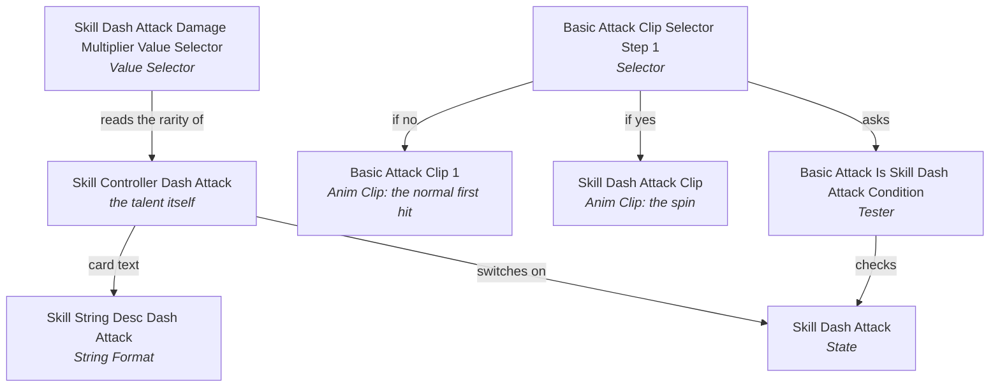
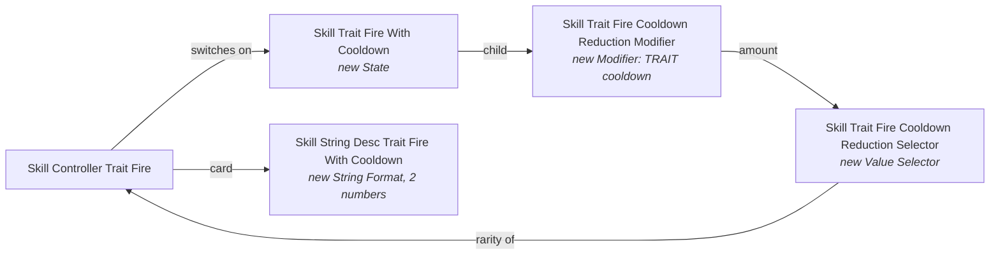

import { Steps, Tabs, TabItem, Aside, Badge, LinkCard, CardGrid } from '@astrojs/starlight/components';

The [beginner tutorial](/guides/talent-tutorial/) changes a talent's numbers and
text. This page goes further and changes **what a talent does**. By the end you
will know how to:

- make a talent play a different attack,
- add an "if the player has this talent, do that" rule,
- make a talent switch on a different effect,
- give a talent an extra bonus, such as a shorter cooldown, with a new number on its card,
- build a new "every N attacks" effect out of pieces the game already has.

You still do not write code. Everything is `manifest.toml`, like before. What
changes is that you now need to understand how a talent is put together inside
the game's files, and this page teaches that first.

<Aside type="caution" title="Finish the beginner tutorial first">
This page assumes you already have the setup from
[Step 1](/guides/talent-tutorial/#step-1-set-up-once), the
`talent_info.py` helper from
[Step 3](/guides/talent-tutorial/#step-3-look-inside-the-talent), and the
testing file from
[Step 10](/guides/talent-tutorial/#step-10-optional-get-the-talent-at-the-start-of-every-run).
You will use all three.
</Aside>

## How much has been tested

Some of these techniques are proven in the game. Others build correct files but
have not been played yet. Each recipe carries one of these labels:

| Label | Meaning |
|---|---|
| <Badge text="Tested in game" variant="success" /> | Someone played it, and it did what the recipe says. |
| <Badge text="Partly tested" variant="caution" /> | Part of it was seen working in the game, and part was not checked yet. |
| <Badge text="Not yet tested" variant="danger" /> | RSMM builds it correctly, but nobody has played it yet. |

Every example on this page builds without errors against the current game
files. "Builds" is not the same as "works", which is why the labels exist.

## Before you start: four rules

1. **Change one thing, then test it.** A wrong link does not show an error. The
   talent just stops working, or does something odd. If you change five things
   at once, you cannot tell which one broke it.
2. **Put all changes to one hero file in one mod.** If two separate mods both
   change `Hero_SunWukong.entity`, only one of them ends up in the game. Inside
   one mod, as many `[[content]]` blocks as you like combine correctly.
3. **Never touch your only copy of the game.** `rsmm restore --all` undoes
   everything RSMM did, so run it whenever something looks wrong.
4. **Test with the talent actually owned.** A talent's effect only runs while you
   have the talent. Use the testing file from the beginner tutorial.

## How a talent works inside

A hero file, like `Hero_SunWukong.entity`, is a big collection of small named
**parts**. Each part does one job, and parts point at each other. A talent is not
one part. It is a small chain of them.

Here is Sun Wukong's **Stick Twirl**, the talent that turns an attack right after
a dash into a spinning attack. This is the real chain from the game's files:



Read it like this:

1. When you pick Stick Twirl, its **Skill Controller** switches on a **State**
   called `Skill Dash Attack`.
2. When you attack, the **Selector** for the first hit asks a **Tester**: "is
   `Skill Dash Attack` switched on, and did the player just dash?"
3. If yes, it plays the spin (**Anim Clip** `Skill Dash Attack Clip`). If no, it
   plays the normal first hit.
4. The **Value Selector** looks up which rarity the controller has, to choose the
   damage.
5. The **String Format** fills in the numbers on the card.

**The big idea:** owning a talent switches on its State, and the rest of the hero
checks that State. To change what a talent does, you change **what points at
what**. That is called a **rewire**.

### The parts you will meet

| Type | What it does |
|---|---|
| **Skill Controller** | The talent itself. Holds its rarity and switches on its State. |
| **State** | Something that is on or off. A talent's State is on while you own the talent. States can have children that run while they are on, such as a Modifier. |
| **Tester** | A yes/no question, for example "is this State on?" |
| **Selector** | Picks one of several options, based on Testers. |
| **Value** | One number. |
| **Value Selector** | One number per rarity. These are the `PER RARITY` lines from `talent_info.py`. |
| **Anim Clip** | One animation, together with the hits, effects and sounds that happen during it. |
| **Modifier** | Changes a stat, such as a cooldown, while its State is on. |
| **Counter** | Counts events and does something when it reaches a number. |
| **Named Event Sender** | Sends a named signal, such as `HORDE_ATTACKS_COUNTER_INC`, that Counters can listen to. |
| **String Format** | Fills the `{0}`, `{1}`, … gaps on a talent card with numbers. |

### Names, labels and hidden links

Every part has a **name**, like `Basic Attack Clip 4`. When one part points at
another, the file stores two things:

- a **hidden ID** of the target, which the game actually follows, and
- a **label**, which is only a note for humans, like
  `[Anim Clip] Hero_SunWukong\Ability Basic\Basic Attack Clip 4`.

A rewire changes the hidden ID and leaves the label alone. After a rewire, the
label can therefore say one thing while the game does another. The inspector
tool below always shows you where a link really goes.

## The inspector: see how parts connect

This helper shows every part of a hero, what each part points at, and what
points at it. Create `talent_graph.py` in the `RavenswatchModManager` folder,
next to `talent_info.py`, and paste this:

```python title="talent_graph.py"
# talent_graph.py - see how the parts of a hero's talents connect.
#
#   python talent_graph.py <Hero> find "<word>"        list parts whose name contains the word
#   python talent_graph.py <Hero> show "<Part name>"   one part: what it uses, and what uses it
#
# Options, added at the end:
#   --mod <mod-id>    look at your mod's changed file instead of the original
#   --file <name>     look in another file of the hero, e.g. --file Hero_Snow_Queen_Ice_Clone
import re
import struct
import sys
from pathlib import Path

from rsmm.engine import cooked
from rsmm.engine import entity_append as EA

args = sys.argv[1:]
options = {}
for flag in ("--mod", "--file"):
    if flag in args:
        at = args.index(flag)
        options[flag] = args[at + 1] if at + 1 < len(args) else ""
        del args[at:at + 2]
if len(args) != 3 or args[1] not in ("find", "show"):
    sys.exit('Usage: python talent_graph.py <Hero> find|show "<text>" [--mod <id>] [--file <name>]')
hero, mode, text = args
stem = options.get("--file") or f"Hero_{hero}"
root = Path("mods") / options["--mod"] / "assets" if "--mod" in options else Path("data/uncooked")
path = (root / "EntitySettings" / "Heroes" / f"Hero_{hero}"
        / f"{stem}.entity.ot.EntitySettingsResource.gen")
if not path.is_file():
    sys.exit(f"No file {path}\nCheck the spelling. For --mod, run rsmm apply first.")

BEGIN, END = cooked.MARK_BEGIN, cooked.MARK_END
cf = cooked.parse(path.read_bytes())
classes = [c.name for c in cf.classes]
picker = classes.index("oCEntityCpntPicker")


def kind_of(class_name):
    words = re.sub(r"^oC(Dt)?(EntityCpnt|EntityComponent)?|Settings$", "", class_name)
    return re.sub(r"(?<=[a-z])(?=[A-Z])", " ", words)


# Every named part: name -> (kind, identity, section index)
parts = {}
for i, sec in enumerate(cf.sections[1:-1], start=1):
    p = sec.payload
    end = p.find(END)
    if end < 0 or end + 24 > len(p):
        continue
    at = end + 20
    n = struct.unpack_from("<I", p, at)[0]
    if not 0 < n < 256:
        continue
    try:
        name = p[at + 4:at + 4 + n].decode("ascii")
    except UnicodeDecodeError:
        continue
    cls = struct.unpack_from("<I", p, 0)[0]
    parts[name] = (kind_of(classes[cls]) if cls < len(classes) else "?", p[at - 16:at], i)


# Testers and collectors keep their conditions in unnamed sub-parts.
count, _ = EA._directory(cf)
owned = set(range(count)) - set(EA.component_vector(cf.sections[-1].payload)[1])


def payloads(index, standalone=False, depth=0):
    """A part's own bytes plus those of every unnamed sub-part it owns."""
    p = cf.sections[index].payload
    yield p
    if depth < 8:
        for off in EA._carrier_refs(p, classes, owned, standalone):
            sub = struct.unpack_from("<I", p, off)[0]
            yield from payloads(1 + sub, True, depth + 1)


def references(index):
    """(identity, label) of every reference a part makes."""
    out = []
    for payload in payloads(index):
        out += refs_in(payload)
    return out


def refs_in(payload):
    out, i = [], payload.find(BEGIN + struct.pack("<I", picker))
    while i != -1:
        if i + 28 <= len(payload):
            n = struct.unpack_from("<I", payload, i + 24)[0]
            if 0 < n < 512:
                label = payload[i + 28:i + 28 + n].decode("utf-8", "replace")
                if label.startswith("["):
                    out.append((payload[i + 8:i + 24], label))
        i = payload.find(BEGIN + struct.pack("<I", picker), i + 1)
    return out


if mode == "find":
    hits = sorted((k, name) for name, (k, _g, _i) in parts.items() if text.lower() in name.lower())
    for kind, name in hits:
        print(f"  {kind:<28} {name}")
    print(f"\n{len(hits)} part(s) in {stem}")
    sys.exit()

if text not in parts:
    sys.exit(f'No part named exactly "{text}". Use: python talent_graph.py {hero} find "<word>"')
kind, guid, index = parts[text]
by_guid = {g: name for name, (_k, g, _i) in parts.items()}
labels = [lab for _n, (_k, _g, i) in parts.items() for g, lab in references(i) if g == guid]
labels = [lab for lab in labels if lab.endswith("\\" + text)] or labels
print(f"{text}\n  type:  {kind}")
print(f"  label: {labels[0] if labels else '(nothing points at it yet)'}")
print("\nUSES (what this part points at):")
for g, label in references(index):
    # The game follows the hidden identity, not the label text, and a rewire
    # changes only the identity. So name the part the identity really leads to.
    if g not in by_guid:
        print(f"  {label}   (in another file)")
        continue
    print(f"  {by_guid[g]}   ({parts[by_guid[g]][0]})")
    note = "" if label.endswith("\\" + by_guid[g]) else "   <- old text, changed by a rewire"
    print(f"      written as: {label}{note}")
print("\nUSED BY (parts that point at this one):")
seen = False
for name, (_k, _g, i) in sorted(parts.items()):
    for g, _label in references(i):
        if g == guid:
            print(f"  {name}")
            seen = True
            break
if not seen:
    print("  (nothing in this file)")
```

The hero name is the **first** spelling from the
[Talent name lookup](/reference/talent-names/) (`SunWukong`, `Snow_Queen`, …).

### Find parts

`find` lists every part whose name contains a word:

```sh
python talent_graph.py SunWukong find "Dash Attack"
```

```text
  Anim Clip                    Skill Dash Attack Clip
  Skill Controller             Skill Controller Dash Attack
  State                        Skill Dash Attack
  Tester                       Basic Attack Is Skill Dash Attack Condition
  Value Selector               Skill Dash Attack Damage Multiplier Value Selector
  ...
27 part(s) in Hero_SunWukong
```

A good first step for any talent is to `find` the **Search word** from the lookup
page.

### Look at one part

`show` takes an exact part name, copied from `find`:

```sh
python talent_graph.py SunWukong show "Basic Attack Clip Selector Step 1"
```

```text
Basic Attack Clip Selector Step 1
  type:  Selector
  label: [Component Selector] Hero_SunWukong\Ability Basic\Basic Attack Clip Selector Step 1

USES (what this part points at):
  Skill Dash Attack Clip   (Anim Clip)
      written as: [Anim Clip] Hero_SunWukong\Skill Dash Attack\Skill Dash Attack Clip
  Basic Attack Is Skill Dash Attack Condition   (Tester)
      written as: [Cpnt Value Tester] Hero_SunWukong\Skill Dash Attack\Basic Attack Is Skill Dash Attack Condition
  Basic Attack Clip 1   (Anim Clip)
      written as: [Anim Clip] Hero_SunWukong\Ability Basic\Basic Attack Clip 1

USED BY (parts that point at this one):
  State Basic Attack Step 1
```

| Line | Meaning |
|---|---|
| `label:` | How other parts write this part's name. Copy it when a recipe asks for a part's **label**. |
| `USES` | What this part points at, and where each link really goes. |
| `written as:` | The label text stored inside this part. Recipes that change a link inside a part match this text. |
| `USED BY` | Which parts point at this one. |

Following `USES` and `USED BY` from part to part is how you work out a chain like
the Stick Twirl diagram above. Start at the talent's `Skill Controller`, then
`show` its State, and keep going.

### Check your own mod

After `rsmm apply`, add `--mod <your-mod-id>` to see the changed file instead of
the original:

```sh
python talent_graph.py SunWukong show "Basic Attack Clip Selector Step 1" --mod twirl-finisher
```

If a link now goes where you wanted, your rewire worked in the file. A link whose
label text is out of date gets a `<- old text, changed by a rewire` note, which
is normal.

## Recipe 1: Make a talent play a different attack

<Badge text="Tested in game" variant="success" />

**Goal:** Stick Twirl's spinning attack becomes the 4th hit of Wukong's normal
combo, with that hit's animation, damage, effects and sound.

**How:** in the chain above, the Selector points at `Skill Dash Attack Clip`.
Point that link at `Basic Attack Clip 4` instead. An Anim Clip carries its hits,
effects and sounds with it, so the whole attack moves.

```toml
[[content]]
kind = "talent"
id   = "twirl_plays_hit_four"
hero = "SunWukong"
file = "Hero_SunWukong.entity"
rewires = [
  { trigger = '[Anim Clip] Hero_SunWukong\Skill Dash Attack\Skill Dash Attack Clip', action = '[Anim Clip] Hero_SunWukong\Ability Basic\Basic Attack Clip 4', exact = true, within = "Basic Attack Clip Selector Step 1", within_span = 600 },
]
```

What each part of the rewire means:

| Field | Meaning |
|---|---|
| `trigger` | The link to change: its `written as:` text from the inspector. |
| `action` | Where it should point now: the target's `label:`, or just its name. |
| `exact = true` | Match the whole label, not just part of it. |
| `within = "..."` | Only change the link inside this part. |
| `within_span = 600` | How far past the part's name to search, in bytes. A few hundred covers a small part. |

<Aside type="tip" title="Use single quotes for labels">
Labels contain backslashes `\`. In TOML, text in `'single quotes'` is taken
exactly as written. Inside `"double quotes"` a backslash starts a special code
and breaks the label.
</Aside>

**Why `exact` and `within`?** A rewire changes the **first** link in the file
whose label matches. In this file the Stick Twirl clip is used by only one part,
so here they are a safety net. Many labels are used by several parts, though, and
without `within` you change whichever comes first, which is often not the one you
mean. Add both whenever you target a link inside one specific part. Recipe 3
shows what goes wrong without them.

**The talent's gate stays:** only the link after "if yes" changed. Without Stick
Twirl, your attacks behave exactly as before.

## Recipe 2: Add an "if this, else that" rule

<Badge text="Tested in game" variant="success" />

**Goal:** after a dash, Wukong's attack becomes **Celestial Pillar**'s slam if you
also own Celestial Pillar, and the 4th combo hit if you do not.

**The problem:** no part says "Pillar owned ? slam : hit 4", so there is nothing
to rewire to.

**The trick:** find a part that already has the right *shape*, copy it, and change
what the copy points at. The copy is called a **clone**.

Wukong's `Basic Attack Combo Selector` has exactly that shape. Check it:

```sh
python talent_graph.py SunWukong show "Basic Attack Combo Selector"
```

```text
USES (what this part points at):
  Skill Attack Finisher Combo   (Attack Combo)
  Skill Attack Finisher   (State)
  Basic Attack Combo   (Attack Combo)
```

In words: "if the State `Skill Attack Finisher` (Celestial Pillar owned) is on,
pick `Skill Attack Finisher Combo`, otherwise pick `Basic Attack Combo`." We copy
it, swap its two results for the two attacks we want, and point Stick Twirl at the
copy:

```toml
[[content]]
kind = "talent"
id   = "twirl_pillar_or_hit_four"
hero = "SunWukong"
file = "Hero_SunWukong.entity"

clone_nodes = [
  { source = "Basic Attack Combo Selector", name = "Twirl Finisher Clip Selector", retarget = [
    { from = '[Dt Attack Combo] Hero_SunWukong\Skill Attack Finisher\Skill Attack Finisher Combo', to = '[Anim Clip] Hero_SunWukong\Skill Attack Finisher\Skill Attack Finisher Clip' },
    { from = '[Dt Attack Combo] Hero_SunWukong\Ability Basic\Basic Attack Combo', to = '[Anim Clip] Hero_SunWukong\Ability Basic\Basic Attack Clip 4' },
  ] },
]

rewires = [
  { trigger = '[Anim Clip] Hero_SunWukong\Skill Dash Attack\Skill Dash Attack Clip', action = "Twirl Finisher Clip Selector", exact = true, within = "Basic Attack Clip Selector Step 1", within_span = 600 },
]
```

| Field | Meaning |
|---|---|
| `source` | The part to copy. |
| `name` | A new, unused name for the copy. |
| `retarget` | Links to change **inside the copy**. `from` is the `written as:` text inside the source part; `to` is the new target's `label:`. |

A clone on its own does nothing, because nothing points at it yet. The `rewires`
entry connects it: `action` is the copy's `name`. Clones are always built first,
so a rewire in the same block can use them.

The tested part is the Pillar branch: with both talents owned, the dash attack
became the Pillar slam. The "no Pillar" branch uses the same file change as
Recipe 1 but has not been played on its own.

## Recipe 3: Make a talent switch on a different effect

<Badge text="Partly tested" variant="caution" />

**Goal:** Scarlet (Red) has a finished POWER finisher in her files, but no talent
ever switches it on. We make **Short Wick** switch it on instead of its own effect.

First look at both controllers:

```sh
python talent_graph.py Red show "Skill Controller Secondary Quick Bombs"
python talent_graph.py Red show "Skill Primary Finisher Finisher Damage Multiplier Selector"
```

Short Wick's controller switches on the State `Skill Secondary Quick Bombs`. The
finisher's damage Value Selector points at `Skill Controller Primary Finisher`, a
controller nobody can ever own, three times, once for each rarity condition. So we
make two changes:

```toml
[[content]]
kind = "talent"
id   = "short_wick_runs_finisher"
hero = "Red"
file = "Hero_Red.entity"
rewires = [
  # 1. The effect: Short Wick switches on the finisher's State.
  { trigger = '[State] Hero_Red\Skill Secondary Quick Bombs\Skill Secondary Quick Bombs', action = '[State] Hero_Red\Skill Primary Finisher\Skill Primary Finisher', exact = true, within = "Skill Controller Secondary Quick Bombs", within_span = 400 },

  # 2. The damage: the finisher reads its rarity from Short Wick.
  { trigger = "Skill Controller Primary Finisher", action = "Skill Controller Secondary Quick Bombs", all = true },
]
```

Two new things here:

- **`all = true`** changes every matching link, not just the first. A Value
  Selector points at its controller once per rarity, and changing only one link
  leaves the other rarities reading the old controller.
- **Why the first rewire needs `exact` and `within`:** the text `Skill Secondary
  Quick Bombs` also appears inside the label of Short Wick's cooldown Modifier,
  which comes earlier in the file. An earlier version of this mod matched that
  shorter text without `exact` and `within`, and changed the Modifier instead of
  the controller's State link. Nothing reported an error.

Pair it with a new name and description from the beginner tutorial, and
optionally flatten the damage with `union_patches`.

**Tested so far:** the damage change reached the game. Whether POWER now ends with
the finisher attack has not been confirmed yet.

## Recipe 4: Add a stat bonus, with a new number on the card

<Badge text="Not yet tested" variant="danger" />

**Goal:** Sun Wukong's **Fiery Dragon** also reduces his TRAIT cooldown: −10 %
Common, −15 % Rare, −20 % Epic, −25 % Legendary. The card shows the number.

This recipe needs four clones, because a stat bonus is a small chain of its own:



### Where the pieces come from

Look at what exists:

```sh
python talent_graph.py SunWukong show "Skill Trait Fire"
python talent_graph.py SunWukong show "Skill Power Hold"
python talent_graph.py SunWukong show "Skill String Desc Dash Sprint"
```

- Fiery Dragon's State `Skill Trait Fire` has **no children** (its `USES` list is
  empty), so there is nowhere to hang a Modifier.
- Wukong's **Power Hold** State has exactly one child, a Modifier, which reads its
  amount from a Value Selector. That is the shape we need, so we copy Power Hold's
  State and Modifier.
- The amount: copy Fiery Dragon's own damage Value Selector. It already reads
  Fiery Dragon's rarity, so we only replace its numbers.
- The card: Fiery Dragon's String Format fills one gap, and we need two. Dash
  Sprint's has two, so we copy that.

### Which stat a Modifier changes

A copied Modifier changes the same stat as the Modifier it was copied from. Power
Hold's changes attack power, not TRAIT cooldown. `modifier_stat` takes the stat from any
other shipped Modifier instead, even another hero's:

| Stat | Copy it from (`hero`, `node`) |
|---|---|
| POWER cooldown | `Snow_Queen`, `Skill Trait Abilities Cooldown Primary CD Modifier` |
| SPECIAL cooldown | `Red`, `Skill Secondary Quick Bombs CD Reduction Modifier` |
| DEFENSE cooldown | `Snow_Queen`, `Skill Trait Abilities Cooldown Defensive CD Modifier` |
| TRAIT cooldown | `Beowulf`, `Skill Trait Quest Complete CD Reduction Modifier` |

To look for other stats, `find "Modifier"` on any hero and read the names.

### The mod

```toml
[[content]]
kind = "talent"
id   = "trait_fire_cooldown_wiring"
hero = "SunWukong"
file = "Hero_SunWukong.entity"

clone_nodes = [
  # The amount: Fiery Dragon's own per-rarity selector, numbers replaced below.
  { source = "Skill Trait Fire Damage Multiplier Selector", name = "Skill Trait Fire Cooldown Reduction Selector" },

  # The Modifier: Power Hold's, reading the new amount, changing TRAIT cooldown.
  { source = "Skill Power Hold AP Modifier", name = "Skill Trait Fire Cooldown Reduction Modifier", modifier_stat = { hero = "Beowulf", node = "Skill Trait Quest Complete CD Reduction Modifier" }, retarget = [
    { from = '[Value Selector] Hero_SunWukong\Skill Power Hold\Skill Power Hold AP Selector', to = '[Value Selector] Hero_SunWukong\Skill Trait Fire\Skill Trait Fire Cooldown Reduction Selector' },
  ] },

  # The State: Power Hold's, holding the new Modifier as its child.
  { source = "Skill Power Hold", name = "Skill Trait Fire With Cooldown", retarget = [
    { from = '[Modifier] Hero_SunWukong\Skill Power Hold\Skill Power Hold AP Modifier', to = '[Modifier] Hero_SunWukong\Skill Trait Fire\Skill Trait Fire Cooldown Reduction Modifier' },
  ] },

  # The card: Dash Sprint's two-number format. {0} = cooldown, {1} = damage.
  { source = "Skill String Desc Dash Sprint", name = "Skill String Desc Trait Fire With Cooldown", retarget = [
    { from = '[Value Selector] Hero_SunWukong\Skill Dash Sprint\Skill Dash Sprint Move Speed Increase Selector', to = '[Value Selector] Hero_SunWukong\Skill Trait Fire\Skill Trait Fire Cooldown Reduction Selector' },
    { from = '[Value] Hero_SunWukong\Skill Dash Sprint\Skill Dash Sprint Max Duration', to = '[Multi values operations] Hero_SunWukong\Skill Trait Fire\Skill Trait Fire Supposed Damage Operation' },
  ], rename = [
    { from = "Skill_Dash_Sprint_Desc", to = "Skill_Trait_Fire_Desc" },
  ] },
]

# 0.25 means -25 %, the same scale Beowulf's Draconic Binds uses.
union_patches = [
  { label = "Skill Trait Fire Cooldown Reduction Selector", index = 1, old = 3.85, new = 0.25 },
  { label = "Skill Trait Fire Cooldown Reduction Selector", index = 3, old = 3.3,  new = 0.20 },
  { label = "Skill Trait Fire Cooldown Reduction Selector", index = 5, old = 2.75, new = 0.15 },
  { label = "Skill Trait Fire Cooldown Reduction Selector", index = 7, old = 2.2,  new = 0.10 },
]

rewires = [
  # Everything that used Fiery Dragon's State now uses the new one.
  { trigger = '[State] Hero_SunWukong\Skill Trait Fire\Skill Trait Fire', action = "Skill Trait Fire With Cooldown", exact = true, all = true },
  # The card reads its numbers from the new two-number format.
  { trigger = '[String Format] Hero_SunWukong\Skills\Skill String Desc Trait Fire', action = "Skill String Desc Trait Fire With Cooldown", exact = true },
]

[[content]]
kind   = "skill"
id     = "trait_fire_cooldown_text"
hero   = "Sun_Wukong"
mode   = "relabel"
source = "Skill_Trait_Fire"
description = "• Adds an explosion of fire to the activation effects of $YANG STANCE*, dealing &{1}~ area damage and inflicting enemies with #IGNITE@\n• #TRAIT@ cooldown &-{0}%~"
```

Three details worth copying into your own work:

- **`rename`** replaces a whole piece of text inside the copy. A String Format
  names the text entry it fills in, so the copy must name Fiery Dragon's
  description, not Dash Sprint's.
- **`all = true` on the State rewire** moves both the controller's link *and* the
  Tester that adds the fire explosion. If you moved only the controller, the
  explosion would stop working.
- **The `old` values in `union_patches`** are the numbers copied along with the
  Value Selector, which were the damage numbers. The new values are percentages
  written as fractions.

## Recipe 5: Build an "every N attacks" effect

<Badge text="Partly tested" variant="caution" />

**Goal:** Piper's **Horde** also summons 3/4/5 rats that attack at once, every 16
basic attacks.

This is the largest recipe. It reuses one idea many times: **find a machine that
already does something similar, clone it, and give the copy its own inputs and
outputs.**

Piper's **Ghost Notes** already counts notes and does something every N of them:

```text
Event Attack Shoot Active          (every note Piper plays)
  -> Ghost Notes Notify Tester     (only if Ghost Notes is owned)
  -> SKILL_ATTACK_GHOST_NOTES_COUNTER_INC Event Sender
Skill Attack Ghost Notes Counter   (listens for that signal, counts to the
                                    Requirement Selector, then fires the proc)
```

The mod builds a second copy of that machine for Horde:

| Clone | Copied from | Changed |
|---|---|---|
| `Horde Attacks Required Selector` | Ghost Notes' threshold | Reads Horde's rarity. All four numbers set to 16. |
| `Horde Attacks Counter` | Ghost Notes' counter | Fires the rat proc. **Listens for its own signal**, `HORDE_ATTACKS_COUNTER_INC`. |
| `HORDE_ATTACKS_COUNTER_INC Event Sender` | Ghost Notes' sender | Sends the new signal. |
| `Horde Attacks State` | Ghost Notes' State | Holds the new counter. Horde's controller points here. |
| `Horde Basic Attack Shoot`, `Horde Basic Attack Notify` | Piper's shot events | Only the **basic** attack sends the new signal. |
| `Horde Rats Count Selector`, `Horde Rats Proc`, `Horde Rats Count Switch` | Invasive Blast's spawn | Spawns Horde's own number of rats, which attack at once. |
| `Skill String Desc Horde Rats` | Sound Barrier's 5-number card format | Shows the new numbers on Horde's card. |

The one new rule this recipe teaches:

<Aside type="caution" title="A copied Counter must listen for a new signal">
Counters and Event Senders find each other **by name**, not by link. A copied
Counter that keeps the original signal name counts the original talent's events
too. Use `rename` on both the Counter and its Event Sender to give them a signal
of their own, like `HORDE_ATTACKS_COUNTER_INC`. In testing, a signal name made up
by a mod was delivered like the game's own.
</Aside>

**Tested so far:** the cloned counter and the made-up signal name worked in the
game, and rats spawned. The final version, with rats counted only from basic
attacks and the corrected card numbers, has not been played yet.

<details>
<summary><strong>Show the full Horde mod</strong></summary>

```toml title="mods/piper-horde/manifest.toml"
[mod]
id          = "piper-horde"
name        = "Piper: Horde of Rats"
version     = "0.1.0"
author      = "YourName"
description = "Horde also summons 3 / 4 / 5 rats that attack at once, every 16 basic attacks."
license     = "MIT"
sdk_version = ">=3.0,<4"
enabled     = true
experimental = true
tags        = ["talents", "piper"]
multiplayer_scope = "local-only"

[[content]]
kind = "talent"
id   = "horde_rats_wiring"
hero = "Piper"
file = "Hero_Piper.entity"

clone_nodes = [
  # -- the rat count ----------------------------------------------------------
  { source = "Skill Defense Spawn Pets Max Count Selector", name = "Horde Rats Count Selector", retarget = [
    { from = '[Dt Skill Controller] Hero_Piper\Skills\Skill Controller Defense Spawn Pets', to = '[Dt Skill Controller] Hero_Piper\Skills\Skill Controller Trait More Controllable Pets' },
  ] },
  { source = "Event Skill Attack Ghost Notes Notify Default", name = "Horde Rats Proc", retarget = [
    { from = '[Named Event Sender] Hero_Piper\Skill Attack Ghost Notes\SKILL_ATTACK_GHOST_NOTES_COUNTER_INC Event Sender', to = '[State] Hero_Piper\Skill Defense Spawn Pets\Event Skill Defense Spawn Pets Proc' },
  ] },
  { source = "Trait Ability Max Controllable Pets Selector", name = "Horde Rats Count Switch", retarget = [
    { from = '[State] Hero_Piper\Skill Trait More Controllable Pets\Skill Trait More Controllable Pets', to = '[State] Hero_Piper\Skill Trait More Controllable Pets\Horde Rats Proc' },
    { from = '[Value Operation] Hero_Piper\Skill Trait More Controllable Pets\Skill Trait More Controllable Pets Count Operation', to = '[Value Selector] Hero_Piper\Skill Trait More Controllable Pets\Horde Rats Count Selector' },
    { from = '[Value] Hero_Piper\Ability Trait\Trait Ability Max Controllable Pets Default Amount', to = '[Value Selector] Hero_Piper\Skill Defense Spawn Pets\Skill Defense Spawn Pets Max Count Selector' },
  ] },

  # -- the counter and its state ----------------------------------------------
  { source = "Skill Attack Ghost Notes Requirement Selector", name = "Horde Attacks Required Selector", retarget = [
    { from = '[Dt Skill Controller] Hero_Piper\Skills\Skill Controller Attack Ghost Notes', to = '[Dt Skill Controller] Hero_Piper\Skills\Skill Controller Trait More Controllable Pets' },
  ] },
  { source = "Skill Attack Ghost Notes Counter", name = "Horde Attacks Counter", retarget = [
    { from = '[State] Hero_Piper\Skill Attack Ghost Notes\Event Skill Attack Ghost Notes Proc', to = '[State] Hero_Piper\Skill Trait More Controllable Pets\Horde Rats Proc' },
    { from = '[Value Selector] Hero_Piper\Skill Attack Ghost Notes\Skill Attack Ghost Notes Requirement Selector', to = '[Value Selector] Hero_Piper\Skill Trait More Controllable Pets\Horde Attacks Required Selector' },
  ], rename = [
    { from = "SKILL_ATTACK_GHOST_NOTES_COUNTER_INC", to = "HORDE_ATTACKS_COUNTER_INC" },
    { from = "SKILL_ATTACK_GHOST_NOTES_COUNTER_DEC", to = "HORDE_ATTACKS_COUNTER_DEC" },
  ] },
  { source = "Skill Attack Ghost Notes", name = "Horde Attacks State", retarget = [
    { from = '[Counter] Hero_Piper\Skill Attack Ghost Notes\Skill Attack Ghost Notes Counter', to = '[Counter] Hero_Piper\Skill Trait More Controllable Pets\Horde Attacks Counter' },
    { from = '[Entity 3d Node] Hero_Piper\Skill Attack Ghost Notes\Skill Attack Ghost Notes 3d Node Left', to = '[Cpnt Value Tester] Hero_Piper\Skill Trait More Controllable Pets\Skill Trait More Controllable Pets Legendary Tester' },
  ] },

  # -- the basic-attack-only signal -------------------------------------------
  { source = "SKILL_ATTACK_GHOST_NOTES_COUNTER_INC Event Sender", name = "HORDE_ATTACKS_COUNTER_INC Event Sender", rename = [
    { from = "SKILL_ATTACK_GHOST_NOTES_COUNTER_INC", to = "HORDE_ATTACKS_COUNTER_INC" },
  ] },
  { source = "Event Primary Ability Shoot", name = "Horde Basic Attack Notify", retarget = [
    { from = '[State] Hero_Piper\Ability Common\Event Attack Shoot Active', to = '[Cpnt Value Tester] Hero_Piper\Skill Attack Ghost Notes\Skill Attack Ghost Notes Notify Tester' },
    { from = '[Named Event Sender] Hero_Piper\Ability Primary\Primary Ability Increase Shoot Spawn Index Event Sender', to = '[Named Event Sender] Hero_Piper\Skill Trait More Controllable Pets\HORDE_ATTACKS_COUNTER_INC Event Sender' },
  ] },
  { source = "Event Attack Shoot Active", name = "Horde Basic Attack Shoot", retarget = [
    { from = '[Cpnt Value Tester] Hero_Piper\Skill Attack Ghost Notes\Skill Attack Ghost Notes Notify Tester', to = '[State] Hero_Piper\Skill Trait More Controllable Pets\Horde Basic Attack Notify' },
  ] },

  # -- the card: {0} rats per trigger, {1} attacks needed, {2} rats per group,
  #    {3} rats per group without Horde, {4} extra max rats --------------------
  { source = "Skill String Desc Defensive Armor Quest", name = "Skill String Desc Horde Rats", retarget = [
    { from = '[Value Selector] Hero_Piper\Skill Defensive Armor Quest\Skill Defensive Armor Quest Objective Count Selector', to = '[Value Selector] Hero_Piper\Skill Trait More Controllable Pets\Horde Rats Count Selector' },
    { from = '[Value] Hero_Piper\Skill Defensive Armor Quest\Skill Defensive Armor Quest Armor Per Proc', to = '[Value Selector] Hero_Piper\Skill Trait More Controllable Pets\Horde Attacks Required Selector' },
    { from = '[Value] Hero_Piper\Skill Defensive Armor Quest\Skill Defensive Armor Quest Character Impacts Required', to = '[Value Selector] Hero_Piper\Skill Trait More Controllable Pets\Skill Trait More Controllable Pets Per Spawn Amount Selector' },
    { from = '[Multi values operations] Hero_Piper\Skill Defensive Armor Quest\Skill Defensive Armor Quest Complete Shield Operation', to = '[Value] Hero_Piper\Ability Trait\Trait Ability Pets Per Spawn Default Amount' },
    { from = '[Value] Hero_Piper\Skill Defensive Armor Quest\Skill Defensive Armor Quest Complete Shield Duration', to = '[Value Selector] Hero_Piper\Skill Trait More Controllable Pets\Skill Trait More Controllable Pets Amount Selector' },
  ], rename = [
    { from = "Skill_Defense_Armor_Quest_Desc", to = "Skill_Trait_More_Controllable_Pets_Desc" },
  ] },
]

union_patches = [
  # Every 16 basic attacks at every rarity.
  { label = "Horde Attacks Required Selector", index = 1, old = 6, new = 16 },
  { label = "Horde Attacks Required Selector", index = 3, old = 7, new = 16 },
  { label = "Horde Attacks Required Selector", index = 5, old = 8, new = 16 },
  { label = "Horde Attacks Required Selector", index = 7, old = 10, new = 16 },
  # 3 rats Common, 4 Rare, 5 Epic and Legendary.
  { label = "Horde Rats Count Selector", index = 1, old = 7, new = 5 },
  { label = "Horde Rats Count Selector", index = 3, old = 6, new = 5 },
  { label = "Horde Rats Count Selector", index = 5, old = 5, new = 4 },
  { label = "Horde Rats Count Selector", index = 7, old = 4, new = 3 },
]

rewires = [
  # Invasive Blast's count store reads the switch instead of its own numbers.
  { trigger = '[Value Selector] Hero_Piper\Skill Defense Spawn Pets\Skill Defense Spawn Pets Max Count Selector', action = "Horde Rats Count Switch", exact = true, within = "Skill Defense Spawn Pets Count Operation Store", within_span = 400 },
  # Horde's controller and both rat selectors use the new State.
  { trigger = '[State] Hero_Piper\Skill Trait More Controllable Pets\Skill Trait More Controllable Pets', action = "Horde Attacks State", exact = true, all = true },
  # Horde's card reads the 5-number format.
  { trigger = '[String Format] Hero_Piper\Skills\Skill String Desc Trait More Controllable Pets', action = "Skill String Desc Horde Rats", exact = true },
  # Only the BASIC attack shot goes through Horde's notify.
  { trigger = '[State] Hero_Piper\Ability Common\Event Attack Shoot Active', action = "Horde Basic Attack Shoot", exact = true, within = "Event Basic Attack Shoot Active", within_span = 300 },
]

[[content]]
kind   = "skill"
id     = "horde_rats_text"
hero   = "Piper"
mode   = "relabel"
source = "Skill_Trait_More_Controllable_Pets"
description = "• For every #{1}@ notes played with #ATTACK@, summon &{0}~ rats that immediately attack nearby enemies\n• Rats spawn in groups of #{2}@ (instead of {3})\n• Increase maximum controllable rats by &{4}~"
```

</details>

## Unlock a LOCKED number

<Badge text="Not yet tested" variant="danger" />

`talent_info.py` marks some single numbers `LOCKED`: the game ignores them and
reads a per-rarity list instead. Usually the right move is to change that list
with `union_patches`. If you want one fixed number at every rarity instead, add
`clear_override = true`:

```toml
value_patches = [
  { label = "Skill Special Marked Value", old = 10.0, new = 12.0, clear_override = true },
]
```

This cuts the link to the per-rarity list, so the talent stops scaling with
rarity.

## All advanced fields

Everything here goes inside a `kind = "talent"` block. A block that uses
`rewires`, `clone_nodes`, `union_patches` or `int_patches` needs a `file = "..."`
line that names exactly one hero file.

### `rewires`

| Field | Required | Meaning |
|---|---|---|
| `trigger` | yes | The link to change, matched against label text. Copy the `written as:` text. |
| `action` | yes | The new target: its `label:`, or just its name. For a clone, use the clone's `name`. |
| `exact` | no | `true` matches the whole label. Without it, any label *containing* the text matches. |
| `within` | no | Only change links inside the part with this exact name. |
| `within_span` | no | How many bytes after that name to search. Default 2048. |
| `all` | no | `true` changes every match. Default: only the first. |
| `count` | no | Change this many matches. |
| `subtest_of` | no | Only change the links a named Tester checks. |

### `clone_nodes`

| Field | Required | Meaning |
|---|---|---|
| `source` | yes | Exact name of the part to copy. |
| `name` | yes | A name no part has yet. |
| `retarget` | no | A list of `{ from, to }`. `from` is a label written inside the source part; `to` is the new target's label. |
| `rename` | no | A list of `{ from, to }` whole pieces of text replaced inside the copy, such as a signal name or a text entry name. |
| `modifier_stat` | no | `{ hero, node }`: make a copied Modifier change the same stat as that Modifier. |

Clones are built before every other change in the block, so a rewire in the same
block can point at them.

### Other fields

| Field | Meaning |
|---|---|
| `value_patches` | Single numbers (beginner tutorial). Add `clear_override = true` to unlock a `LOCKED` one. |
| `union_patches` | Per-rarity numbers (beginner tutorial). |
| `int_patches` | An older way to write whole numbers inside a part. Use `union_patches` instead. |

## Rules that save hours

- **Look before you rewire.** `show` the part you want to change *and* the part
  you want to point at. Most mistakes are pointing at a part with a similar name.
- **Use `exact` and `within`** whenever the label text could also appear inside a
  longer label. Recipe 3's Short Wick mistake is the classic case.
- **Use `all = true` for Value Selectors and States that many parts share.** A
  per-rarity list points at its controller once per rarity.
- **Shared parts are shared.** If two talents use the same part, rewiring that
  part changes both talents. Clone it first and change the copy, as Recipe 5 does
  with Invasive Blast's numbers.
- **Clone small logic parts only:** Selectors, Value Selectors, States, Testers,
  Counters, Modifiers, Event Senders, String Formats. Parts that own animations,
  visual effects or spawners contain pieces RSMM does not copy. Point *at* those
  instead of cloning them.
- **Card numbers come from a String Format.** To show a new number, clone a String
  Format with enough gaps, retarget each gap, `rename` its text entry to your
  talent's `_Desc`, and rewire the controller's `[String Format]` link to the copy.
  Keep the description's `{0}`…`{N}` in the same order as the gaps.
- **Check the file, then check the game.** `talent_graph.py … --mod <id>` proves
  the link is in the file. Only playing with the talent owned proves it works.

## Troubleshooting

| Message | What it means | How to fix it |
|---|---|---|
| `no picker reference matching '...'` | No link has that label text. | Copy the `written as:` text from `show`, including the `[Type]` part. |
| `rewire '...' -> '...': already points there` | The link already goes to that target. | Nothing to do, or you picked the wrong `trigger`. |
| ``rewires/int_patches need `file` to select exactly one entity file`` | The block has no `file` line. | Add `file = "Hero_<Hero>.entity"`. |
| `a component named '...' already exists` | The clone's `name` is taken. | Pick a new name. |
| `expected exactly one component named '...', found 0` | The clone's `source` is misspelled. | Copy the exact name from `find`. |
| `clone of '...': no reference labelled '...'` | A `retarget` `from` is not a link inside the source part. | `show` the source part and copy a `written as:` text. |

**It builds, but the game shows no change:**

1. Check with `talent_graph.py … --mod <id>` that the link goes where you meant.
2. Make sure you own the talent (use the testing file) and are playing that hero.
3. Make sure no other mod changes the same hero file.
4. Make sure you changed the link the game actually uses. A hero often has similar
   parts for different forms, such as Wukong's `… Condition` and `… Condition Yin`.
   `USED BY` shows which ones are really connected.

<CardGrid>
  <LinkCard title="Talent modding, step by step" href="/guides/talent-tutorial/" description="The beginner tutorial this page builds on." />
  <LinkCard title="Talent name lookup" href="/reference/talent-names/" description="Every hero's talents with the names a mod needs." />
</CardGrid>
