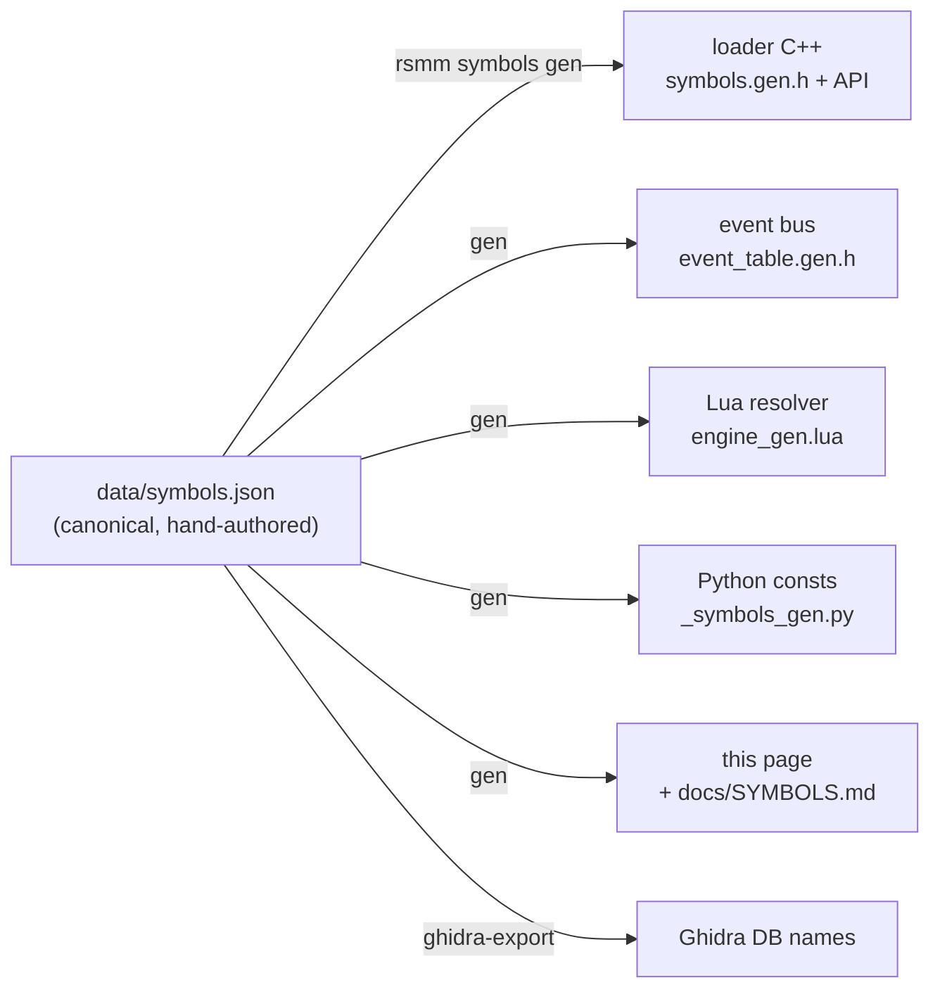

One human-authored source (`data/symbols.json`) generates every downstream artifact:

> GENERATED by `rsmm symbols gen` from `data/symbols.json` — do not edit by hand.

Canonical map of Ravenswatch engine functions/globals/events to stable
semantic names. `status`: **ok** = resolvable by byte pattern in the current
corpus (survives game updates); **va** = base-relative absolute (data globals);
**unverified** = documented in an older corpus, address not re-confirmed.
Functions tagged `callable` have a typed C++ accessor in `engine::` and a Lua
resolver entry. See [CLAUDE.md] for the workflow.

Total: **184** symbols across 18 categories.

## combat

| name | address | status | callable | signature / note |
|------|---------|--------|----------|------------------|
| `HeroStats_OnDamageDealt` | `0x14039aef0` | ✅ ok |  | void(void* hero, void* stats, void* payload, int type) |
| `HeroStats_OnDamageTaken` | `0x1403a0940` | ✅ ok |  | void(void* hero, void* payload) |
| `ProjectileAttack_BeginAttack` | `0x14083e7d0` | ✅ ok | ✔ | void(void* projectile_attack_cpnt) |

## enemies

| name | address | status | callable | signature / note |
|------|---------|--------|----------|------------------|
| `EnemyCamp_Stage3Filter` | `0x140323830` | ❓ unverified |  | void(void* candidatesVec, void* searchFilter) |
| `EnemyCamp_TierSelector` | `0x14032e790` | ✅ ok |  | void(void* selector) |
| `EnemyCamp_TribeEntryBuilder` | `0x14032fe20` | ✅ ok |  | void(void* selector, void* specialEntry, void* outEntries, float mult) |
| `EnemyDef_PostLoad` | `0x14031a800` | ✅ ok |  | bool(void* enemyDef) |
| `EnemyDefinition_ctor` | `0x1401df270` | ✅ ok |  | void*(void* self) |
| `EnemyTribeDef_PostLoad` | `0x14031bae0` | ✅ ok |  | bool(void* tribeDef) |
| `EnemyTribeDefinition_ctor` | `0x1400c5260` | ✅ ok |  | void*(void* self) |
| `Enemy_RuntimeSpawnPicker` | `0x140364360` | ❓ unverified |  | void(void* spawnerCpnt) |
| `MapCtx_DistributeEnemyCampTiers` | `0x1401e8830` | ✅ ok |  | void(void* mapSceneContext) |

## engine

| name | address | status | callable | signature / note |
|------|---------|--------|----------|------------------|
| `Entry_Ctor` | `0x1402154b0` | ✅ ok | ✔ | void(void* base, uint32_t count) |
| `Format_String` | `0x1402092a0` | ✅ ok |  | printf-style format/string builder (e.g. 'Is Hero liked by {}', 'Chance to give {} MO')… |
| `LevelLoad_Orchestrator` | `0x14028e5f0` | ✅ ok |  | i64(void* levelGs) |
| `String_Assign` | `0x140529860` | ✅ ok | ✔ | void(void* dst_slot, const StringDesc* src) |
| `Vector_Grow` | `0x140155230` | ✅ ok | ✔ | void(void* vec, void* /*dead RDX*/, uint32_t new_cap /*R8*/) |

## engine-core

| name | address | status | callable | signature / note |
|------|---------|--------|----------|------------------|
| `ClassRegistry_FindByKey` | `0x140523a10` | ❓ unverified |  | void*(void* unused, void* identityKey) |
| `ClassRegistry_Global` | `0x141436690` | 📍 va |  | Global class-descriptor registry: ptr to {descPtr array @+0x0, u32 count @+0x8}. Scanne… |
| `CustomFlagFilter_Serialize` | `0x140189830` | ✅ ok |  | bool(void* flagFilter, void* reader) |
| `CustomFlagList_Serialize` | `0x140681e60` | ❓ unverified |  | bool(void* flagList, void* reader) |
| `GameScene_FindContextByTester` | `0x14066cad0` | ✅ ok |  | void*(void* gameScene, void* kindOfTypeTester) |
| `Profiler_GetThreadScopeStack` | `0x14053a660` | ❓ unverified |  | void*(void) |
| `Property_EvaluateByGuid` | `0x1406ab910` | ✅ ok |  | bool(void* ctx, void* container, void* guid16, float* out) |
| `ResourceRef_Serialize` | `0x1401cbba0` | ❓ unverified |  | bool(void* reader, void* refSlot) |
| `Serializer_GetClassVersion` | `0x140514570` | ❓ unverified |  | void*(void* reader, void* out, uint32_t classHash) |
| `Serializer_ReadPolyPtrVector` | `0x14020e000` | ✅ ok |  | bool(void* reader, void* vec, const char* label) |
| `ServiceRegistry_Global` | `0x14146f740` | 📍 va |  | Global engine service registry: service array @+0x30, u32 count @+0x38; each entry -> s… |
| `StringVector_Serialize` | `0x140684f30` | ❓ unverified |  | bool(void* reader, void* strVec) |

## entity

| name | address | status | callable | signature / note |
|------|---------|--------|----------|------------------|
| `EntityPool_AllocNode` | `0x140690e50` | ✅ ok |  | void*(void* pool) |
| `EntitySpawner_InstantiateRecord` | `0x140730f80` | ✅ ok |  | void(oCEntityCpntEntitySpawner* self, void* spawnRecord) |
| `EntitySpawner_SpawnOne` | `0x140730150` | ✅ ok |  | void(oCEntityCpntEntitySpawner* self) |
| `EntityStore_CreateEntity` | `0x1406f5dc0` | ✅ ok |  | void*(void* ctx, void* entityStore, void* xform4x4, void* cbCtx) |
| `EntityValueEntry_Ctor` | `0x140747120` | ✅ ok | ✔ | void(void*, void*) |
| `EntityValueOverride_Alloc` | `0x140770290` | ✅ ok | ✔ | void*(void*, uint32_t, uint32_t) |
| `EntityValueStore_ApplyModifierEvent` | `0x14074b2f0` | ✅ ok | ✔ | void(void* store, void* modifierEvent, void* a3, void* a4) |
| `EntityValueStore_InitBaseValues` | `0x140747f20` | ✅ ok | ✔ | void(void* store) |
| `EntityValueStore_Recompute` | `0x140749a90` | ✅ ok | ✔ | void(void* store, void* valueDef) |
| `EntityValueUnion_Compare` | `0x14082ceb0` | ✅ ok | ✔ | uint32_t(void*, void*) |
| `EntityValueUnion_CopyAssign` | `0x14082b1d0` | ✅ ok | ✔ | void(void*, void*) |
| `EntityValueUnion_DefaultCtor` | `0x14082aa60` | ✅ ok | ✔ | void*(void*) |
| `EntityValueUnion_Destruct` | `0x14082dae0` | ✅ ok | ✔ | void(void*) |
| `EntityValueUnion_InitAsType` | `0x14082d670` | ✅ ok | ✔ | void(void*, uint32_t) |
| `EntityValue_Get` | `0x1403c7fa0` | ✅ ok | ✔ | void(void* valueCtx, oCEntityValueUnion* out, uint32_t crcKey) |
| `EntityValue_Lookup` | `0x140749260` | ✅ ok | ✔ | oCEntityValueUnion*(void* store, oCEntityValueUnion* out, uint32_t crcKey) |
| `Entity_AllocInstance` | `0x1406a8d80` | ❓ unverified | ✔ | void*(void* allocator) |
| `Entity_DispatchHit` | `0x1406e3ce0` | ✅ ok | ✔ | void(oCEntity* target, oCEntityHitData* hit) |
| `Entity_FindComponentByType` | `0x1406e3210` | ✅ ok | ✔ | oIEntityCpnt*(oCEntitySpawnerGo* go, oCMetaClass* meta) |
| `Entity_FindMagicalObjectComponent` | `0x1406fb8a2` | ❓ unverified | ✔ | void*(void* instance, void* mo_component_meta) |
| `Entity_GainHealthHandler` | `0x140399d00` | ✅ ok |  | void(oCEntity* hero, void* a2, void* valueCtx) |
| `Entity_GetComponentByTester` | `0x1406e3210` | ✅ ok | ✔ | void*(void*, void*) |
| `Entity_GetComponentFast` | `0x1406e31a0` | ✅ ok | ✔ | void*(void*, void*, uint32_t) |
| `Entity_ModifyHealth` | `0x14039a320` | ✅ ok | ✔ | void(oCEntity* hero, float delta, oCCustomFlagList* sourceTags) |
| `Entity_ResolveAttackHits` | `0x1403dd540` | ✅ ok | ✔ | float(void* attacker, uint hitDefIndex, TargetList* targets, float damageMul, float bas… |
| `HeroController_Ctor` | `0x14038ec30` | ✅ ok | ✔ | oCDtEntityCpntHeroController*(oCDtEntityCpntHeroController* self) |
| `HeroController_HudMirror_Ctor` | `0x1403b3c70` | ✅ ok |  | Builds the hero's HUD HP-mirror object whose pointer is stored at hero+0x1d80 by HeroCo… |
| `MapCtx_LinkPairedSpawners` | `0x1401ebad0` | ✅ ok |  | void(void* mapSceneContext) |
| `ModifierEvent_Ctor` | `0x140389fb0` | ✅ ok | ✔ | void*(void* buf, void* valueDef) |
| `g_MagicalObjectComponentMeta` | `0x141470768` | 📍 va |  | oCMetaClass* for the magical-object component; passed to Entity_FindMagicalObjectCompon… |
| `oCCustomFlagList_vftable` | `0x140f01650` | 📍 va |  | vftable of oCCustomFlagList. An empty list is the 0x18-byte struct { vftable @+0x0, lis… |
| `oCEntityHitData_vftable` | `0x140f137d8` | 📍 va |  | vftable of oCEntityHitData (the ~0xb0-byte hit descriptor passed to Entity_DispatchHit … |
| `oCEntityValueUnion_vftable` | `0x140f95008` | 📍 va |  | vftable of oCEntityValueUnion, the ~0x20-byte tagged value returned by EntityValue_Look… |
| `oCGameEventNetworkModifier_vftable` | `0x140f322d0` | 📍 va |  | vftable of oCGameEventNetworkModifier — the durable stat-modifier named event (leaf of … |

## entity-values

| name | address | status | callable | signature / note |
|------|---------|--------|----------|------------------|
| `EntityValueRegistry_RegisterAll` | `0x1401da350` | ✅ ok |  | void(void) |

## event

| name | address | status | callable | signature / note |
|------|---------|--------|----------|------------------|
| `Analytics_SubmitNamedEvent` | `0x1401fad70` | ✅ ok | ✔ | void(void* analytics_mgr, void* payload_kv, StringDesc* event_name, char has_run_ctx) |
| `Crc32_TableInit` | `0x14051ef30` | ✅ ok |  | Builds the 256-entry CRC32 lookup table at DAT_141436710 (lazy, runtime — the table is … |
| `EventQueue_Drain` | `0x1406642d0` | ✅ ok |  | void(void* queue) |
| `Event_LevelUp` → `level_up` | `0x1401f6bf0` | ✅ ok | ✔ | Emitter whose body references the 'level_up_reach' string (xref 0x1401f64a4). void(ctx,… |
| `Event_RunEnd` → `run_end` | `0x1401f59c0` | ✅ ok | ✔ | Emitter whose body references the 'run_end' string (xref 0x1401f5347). Loader post-deto… |
| `Id_HashString` | `0x14033f7a0` | ❓ unverified |  | Runtime string -> 32-bit id hasher: standard CRC32 over the name bytes (init 0xffffffff… |
| `NamedEvent_ChannelMap_Find` | `0x14066dc10` | ✅ ok | ✔ | iter*(void* channel_map, iter* out, uint32_t* event_id) |
| `NamedEvent_Delete` | `0x1401273b0` | ✅ ok | ✔ | void(oCGameNamedEvent* ev) |
| `NamedEvent_Dispatch` | `0x14066b6b0` | ✅ ok | ✔ | void(void* dispatcher, oCGameNamedEvent* ev) |
| `NamedEvent_EmitNetworkDamageFromHit` | `0x1407276a0` | ✅ ok |  | Reference emitter for NETWORK_DAMAGE: stack-builds the full oCGameNamedEventNetworkDama… |
| `NamedEvent_GiveMagicalObject_Ctor` | `0x14030fd30` | ✅ ok | ✔ | oe::dt::NamedEventGiveMagicalObject*(void* buf) |
| `NamedEvent_HeroSubscribeAll` | `0x140391860` | ✅ ok | ✔ | void(oCEntity* hero) |
| `NamedEvent_HeroUnsubscribeAll` | `0x140395350` | ✅ ok |  | Hero teardown twin of NamedEvent_HeroSubscribeAll: walks the same (id global, slot) pai… |
| `NamedEvent_Id_FromCrc` | `0x14051f090` | ✅ ok | ✔ | uint32_t(uint32_t ns, uint32_t name_crc) |
| `NamedEvent_NetSend` | `0x14073d730` | ✅ ok | ✔ | void(void* net_event_cpnt, oCGameNamedEvent* ev) |
| `NamedEvent_NetSendToPeer` | `0x1407216c0` | ✅ ok | ✔ | void(void* net_event_cpnt, oCGameNamedEvent* ev, uint64_t* peer_session) |

## hero

| name | address | status | callable | signature / note |
|------|---------|--------|----------|------------------|
| `GroupLevelComponent_Ctor` | `0x1402e1de0` | ✅ ok | ✔ | void*(void* self) |
| `Hero_GainExperience` | `0x1402e2f00` | ✅ ok | ✔ | void(void*, void*) |
| `XpComponent_GetMaxLevel` | `0x1402e2d30` | ✅ ok | ✔ | uint32_t(void*) |
| `XpComponent_IsMaxLevel` | `0x1402e2d90` | ✅ ok | ✔ | bool(void*) |
| `XpComponent_SetLevel` | `0x1402e3190` | ✅ ok | ✔ | void(void*, uint32_t) |
| `XpComponent_SetXp` | `0x1402e3630` | ✅ ok | ✔ | void(void*, uint32_t) |
| `XpComponent_TypeTester` | `0x141476e00` | 📍 va |  | Type-tester global (DAT_141476e00) used by the XP component's own IsKindOf/parent-resol… |
| `XpComponent_XpForLevel` | `0x1402e2c30` | ✅ ok | ✔ | uint32_t(void*, uint32_t) |
| `XpComponent_vftable` | `0x140f231b0` | 📍 va |  | Vftable of the hero's XP/level component. CORRECTED 2026-07-18 from 0x140f23200, which … |

## heroes

| name | address | status | callable | signature / note |
|------|---------|--------|----------|------------------|
| `ChallengeUnlock_IsUnlocked` | `0x1402b1100` | ✅ ok | ✔ | bool(void* condition_data) |
| `HeroDef_Deserialize` | `0x14031ef30` | ✅ ok | ✔ | bool(oCDtHeroDefinition* def, oCBinaryStream* stream) |
| `HeroDef_LoadBaseEntity` | `0x14031ece0` | ✅ ok |  | void(void* heroDef, void** outEntityRef) |
| `HeroDef_LoadSkinEntity` | `0x14031ea40` | ✅ ok |  | void(void* heroDef, uint16_t skinIndex, void* outHandle) |
| `HeroProgressionUnlock_IsUnlocked` | `0x1402b2b10` | ✅ ok | ✔ | bool(void* condition_data) |
| `HeroRankLock_IsUnlocked` | `0x1402b1c10` | ✅ ok | ✔ | bool(void* condition_data) |
| `HeroStoryUnlock_IsUnlocked` | `0x1402b21a0` | ✅ ok | ✔ | bool(void* condition_data) |

## items

| name | address | status | callable | signature / note |
|------|---------|--------|----------|------------------|
| `Entity_GiveHandler` | `0x1403c7560` | ✅ ok |  | void(oCEntityValueContext* heroValueCtx, oCEntity* hero, void* hitCtx) |
| `Entity_LookupMagicalObjectComponent` | `0x1406e3280` | ✅ ok | ✔ | void*(void* componentStore, void** out, oCEntity* entity) |
| `Hero_GrantMagicalObject` | `0x140397aa0` | ✅ ok | ✔ | void(oCDtEntityCpntHeroController* hero, void* def, uint16_t count, char dupFlag, void*… |
| `InitialLoading_SpawnMagicalObjects` | `0x140259060` | ❓ unverified |  | Boot 'InitialLoading - MagicalObject SpawnAllObjects' caller that invokes SpawnAllObjec… |
| `MagicalObjectPool_Grow` | `0x140156de0` | ❓ unverified | ✔ | void(void* pool_plus_0x10, uint32_t count, uint32_t by) |
| `MagicalObjectPool_SourceLookup` | `0x14025e3e0` | ❓ unverified | ✔ | void*(void* pool, void* out, void* id) |
| `MagicalObject_RegisterInstance` | `0x1403abb90` | ✅ ok | ✔ | void(oCDtEntityCpntHeroController* hero, void* instance, char addToActive) |
| `MagicalObject_SpawnAllObjects` | `0x140259060` | ✅ ok | ✔ | void(void* pool, void* scene) |
| `MagicalObject_SpawnContainingFunc` | `0x14025d9b0` | ✅ ok |  | Outer function (1283 bytes) that contains the inlined SpawnAllObjects entry at +0x70. T… |
| `g_MagicalObjectPool` | `0x14143cc18` | 📍 va |  | [2026-07-10: re-derived post 2026-07-09 patch (was 0x1414365d0); confirmed via readers … |

## library

| name | address | status | callable | signature / note |
|------|---------|--------|----------|------------------|
| `AchievementDef_PostLoad` | `0x140312060` | ✅ ok | ✔ | bool(void* definition) |
| `ChallengeDef_PostLoad` | `0x140324f30` | ✅ ok | ✔ | bool(void* definition) |
| `Definition_DeserializeBase` | `0x140310180` | ✅ ok |  | bool(void* def, void* reader) |
| `Definition_PostLoad` | `0x140310200` | ✅ ok | ✔ | bool(void* definition) |
| `Definition_PreUnload` | `0x140310230` | ✅ ok | ✔ | void(void*) |
| `DreamShardDef_PostLoad` | `0x140312690` | ✅ ok | ✔ | bool(void* definition) |
| `EnemyCampTierDef_PostLoad` | `0x140319620` | ✅ ok | ✔ | bool(void* definition) |
| `GameModeDefaultDef_PostLoad` | `0x140325950` | ✅ ok | ✔ | bool(void* definition) |
| `GameModifierDef_PostLoad` | `0x140326250` | ✅ ok | ✔ | bool(void* definition) |
| `GameModifierDef_RegisterAssetLoader` | `0x1403260b0` | ✅ ok |  | void(void* assetClassDesc) |
| `GoPtrOwnerRelay_ForwardCall` | `0x14066bf00` | ✅ ok |  | oIGoPtrOwnerRelay base virtual (slot +0x18): resolves owned via slot-0x30, forwards own… |
| `GoPtrOwnerRelay_ForwardGet` | `0x14066be70` | ✅ ok |  | oIGoPtrOwnerRelay base virtual (vtable 0x140f06820 slot +0x8): resolves the owned objec… |
| `GoPtrOwnerRelay_ForwardSet` | `0x14066bec0` | ✅ ok |  | oIGoPtrOwnerRelay base virtual (slot +0x10): resolves owned via slot-0x30, forwards own… |
| `HasGameModifierStateMachine_Register` | `0x140197780` | ✅ ok |  | void(void) |
| `HeroDef_PostLoad` | `0x14031fd70` | ✅ ok | ✔ | bool(void* definition) |
| `IngredientDef_PostLoad` | `0x140323190` | ✅ ok | ✔ | bool(void* definition) |
| `Library_AchievementDefinition_vftable` | `0x1414113b0` | 📍 va |  | vftable of oCTLibrary<oe::dt::AchievementDefinition> singleton. |
| `Library_ChallengeDefinition_vftable` | `0x141413010` | 📍 va |  | vftable of oCTLibrary<oe::dt::ChallengeDefinition> singleton. |
| `Library_DreamShardDefinition_vftable` | `0x141411050` | 📍 va |  | vftable of oCTLibrary<oCDtDreamShardDefinition> singleton. |
| `Library_EnemyCampDifficultyDefinition_vftable` | `0x141411710` | 📍 va |  | vftable of oCTLibrary<oCDtEnemyCampDifficultyDefinition> singleton. |
| `Library_EnemyCampTierDefinition_vftable` | `0x141411560` | 📍 va |  | vftable of oCTLibrary<oCDtEnemyCampTierDefinition> singleton. |
| `Library_EnemyDefinition_vftable` | `0x1414118c0` | 📍 va |  | vftable of oCTLibrary<oCDtEnemyDefinition> singleton. |
| `Library_EnemyTribeDefinition_vftable` | `0x141411200` | 📍 va |  | vftable of oCTLibrary<oCDtEnemyTribeDefinition> singleton. |
| `Library_EntitySettingsResource_vftable` | `0x141470950` | 📍 va |  | vftable of oCTLibrary<oCEntitySettingsResource> singleton. |
| `Library_GameModifierDefinition_vftable` | `0x141411b50` | 📍 va |  | vftable of oCTLibrary<oe::dt::GameModifierDefinition> singleton. GameModifiers = the ru… |
| `Library_IngredientDefinition_vftable` | `0x141412c50` | 📍 va |  | vftable of oCTLibrary<oCDtIngredientDefinition> singleton. |
| `Library_MapDefinition_vftable` | `0x141412520` | 📍 va |  | vftable of oCTLibrary<oCDtMapDefinition> singleton. |
| `Library_MelodyDefinition_vftable` | `0x1414129c0` | 📍 va |  | vftable of oCTLibrary<MelodyDefinition> singleton. |
| `Library_RewardDefinition_vftable` | `0x141412e00` | 📍 va |  | vftable of oCTLibrary<oCDtRewardDefinition> singleton. |
| `Library_TileDefinition_vftable` | `0x141412080` | 📍 va |  | vftable of oCTLibrary<oCDtTileDefinition> singleton. |
| `Library_VersionDefinition_vftable` | `0x141412300` | 📍 va |  | vftable of oCTLibrary<oe::dt::VersionDefinition> singleton (LiveOps version manifest). |
| `MapDef_PostLoad` | `0x1403234f0` | ✅ ok | ✔ | bool(void* definition) |
| `MapDef_RegisterAssetLoader` | `0x140323350` | ✅ ok |  | void(void* assetClassDesc) |
| `MelodyDef_PostLoad` | `0x140326f50` | ✅ ok | ✔ | bool(void* definition) |
| `Mem_Alloc16Zeroed` | `0x14050d5c0` | ✅ ok |  | malloc(0x10) + zero two qwords + bump global alloc counter DAT_1414442b4 = 16-byte zero… |
| `PtrVector_Resize` | `0x140155230` | ✅ ok |  | pointer-vector resize: param_3==0 frees vec[0] (free-counter DAT_14146d854), else mallo… |
| `Registry_EnemyDefinition_desc` | `0x141470208` | 📍 va |  | Class registry descriptor for oCDtEnemyDefinition (set by registrar FUN_14022d940; UID … |
| `Registry_EnemyTribeDefinition_desc` | `0x14146f938` | 📍 va |  | Class registry descriptor for oCDtEnemyTribeDefinition (registrar FUN_140189410; UID 0x… |
| `RewardDef_RegisterAssetLoader` | `0x140324460` | ✅ ok |  | void(void* assetClassDesc) |
| `Rt_FailFast` | `0x140cc7e04` | ✅ ok |  | CRT fail-fast: FUN_140cc7c90 then _invoke_watson (noreturn). 4459 refs. Naming it de-no… |
| `SharedRef_AddRefCopy` | `0x1401663a0` | ✅ ok |  | base virtual: copies {*(this+0x18) data, *(this+0x20) refblock} into out and addrefs at… |
| `SharedRef_AddRefCopy_b` | `0x14021e390` | ✅ ok |  | identical twin of SharedRef_AddRefCopy (separate TU); base virtual in 298 vtables. Deco… |
| `SharedRef_Release` | `0x140111cf0` | ✅ ok | ✔ | void(void*) |
| `TypeDesc_HashName` | `0x1404fd5d0` | ✅ ok |  | base virtual: vcall slot0 -> type descriptor, reads its oCString name (inline @+8 / hea… |
| `TypeDesc_HashName_b` | `0x1401c96e0` | ✅ ok |  | identical twin of TypeDesc_HashName (separate TU); base virtual in 292 vtables. Decompi… |
| `oCString_Dtor` | `0x140111d90` | ✅ ok |  | oCString destructor: SSO threshold 0xf; heap buffer's real alloc ptr at [buf-8], frees … |

## netcode

| name | address | status | callable | signature / note |
|------|---------|--------|----------|------------------|
| `Entity_GetNetComponent` | `0x140312db0` | ✅ ok | ✔ | void*(oCEntity* entity) |
| `Entity_GetNetId` | `0x1407273c0` | ✅ ok |  | uint32_t(void* entity) |
| `Netcode_Channel_LookupById` | `0x140241a50` | ✅ ok | ✔ | iter*(void* channel_map, iter* out, uint32_t* event_id) |
| `Netcode_Channel_Unsubscribe` | `0x1401c8da0` | ✅ ok | ✔ | void(void* node_plus_8, void** sub_slot) |
| `Netcode_DropPeer` | `0x1402b4d50` | ✅ ok |  | Drops a peer after the reconnect window (default 60s) elapses. Pattern-verified 2026-07… |
| `Netcode_EntityReplSetup` | `0x14073dda0` | ❓ unverified | ✔ | void(void* replContext) |
| `Netcode_PeerStateTick` | `0x1402b03a0` | ✅ ok |  | Per-peer connection-state tick (peer conn-state enum at peer+0xCC; 3=connected). Reconn… |

## options

| name | address | status | callable | signature / note |
|------|---------|--------|----------|------------------|
| `g_GameOptions` | `0x14143cb58` | 📍 va |  | [2026-07-10: re-derived post 2026-07-09 patch (was 0x141436510); ctor is now FUN_1401ca… |

## resource

| name | address | status | callable | signature / note |
|------|---------|--------|----------|------------------|
| `Definitions_LoadGroup` | `0x140310300` | ✅ ok |  | Loads the 'Definitions' group / VersionDefinition manifest (triggers loading the curate… |
| `InitialLoading_LoadAllDefinitions` | `0x140260b80` | ✅ ok |  | void(void* nameFilter) |
| `Registry_EnumInstances` | `0x140241750` | ✅ ok | ✔ | void*(void* unused, void* out3, void** classDescPtr) |
| `Registry_RegisterInstance` | `0x1403119d0` | ✅ ok |  | void(void* definition) |
| `Registry_UnregisterInstance` | `0x140311a50` | ✅ ok | ✔ | void(void*) |
| `ResourceRef_Resolve` | `0x140492540` | ✅ ok |  | void(void* refBlock, void* classDesc, void** outResolved, void* policy) |
| `Resource_LookupByPath` | `0x14049b2a0` | ✅ ok | ✔ | void*(const char* decoded_path, void*, void*, void*) |

## rewards

| name | address | status | callable | signature / note |
|------|---------|--------|----------|------------------|
| `CustomFlagList_ContainsAll` | `0x14066ac70` | ✅ ok |  | bool(void* flagListA, void* flagListB) |
| `CustomFlagList_ContainsAny` | `0x14066ad90` | ✅ ok |  | bool(void* flagListA, void* flagListB) |
| `RewardDef_Deserialize` | `0x1403244c0` | ✅ ok |  | bool(void* rewardDef, void* reader) |
| `RewardItem_Serialize` | `0x140323dd0` | ✅ ok |  | bool(void* oCItem, void* reader) |
| `RewardSelectorSettings_Serialize` | `0x140340470` | ✅ ok |  | bool(void* settings, void* reader) |
| `RewardType_Serialize` | `0x140324260` | ✅ ok |  | bool(void* oCType, void* reader) |
| `Reward_GenerateAndDistribute` | `0x1401ecd10` | ❓ unverified |  | void(void* mapSceneContext) |
| `Reward_InitAllRewards` | `0x1401e9800` | ✅ ok |  | _InitAllRewards (7351 bytes): reward-type registrar. The actual reward roller is a sibl… |

## session

| name | address | status | callable | signature / note |
|------|---------|--------|----------|------------------|
| `Account_GetDisplayName` | `0x140929940` | ✅ ok |  | void(std::string* out, void* account) |

## skins

| name | address | status | callable | signature / note |
|------|---------|--------|----------|------------------|
| `SkinGrid_Populate` | `0x1401f16f0` | ✅ ok | ✔ | void(void* ctx, void* arg) |
| `SkinRoster_Build` | `0x1401dd2c0` | ✅ ok |  | Skin-pack roster builder. Selectable-skin count (9) is baked into its loop; a new selec… |
| `g_RosterManager` | `0x141436590` | 📍 va |  | Manager pointer global (relocated by the live image base) walked by the skin-grid popul… |

## ui

| name | address | status | callable | signature / note |
|------|---------|--------|----------|------------------|
| `BookController_ResolveSettings` | `0x140307a30` | ✅ ok | ✔ | void(oCDtEntityCpnt3DBookController* self) |
| `BookController_ResolveTabs` | `0x140308cd0` | ✅ ok | ✔ | void(oCDtEntityCpnt3DBookController* self) |
| `UiButton_InputPoll` | `0x1407d72a0` | ✅ ok | ✔ | void(ButtonUiCpntArray* cpnts) |
| `UiButton_PressCommit` | `0x1406a08a0` | ✅ ok | ✔ | void(oCUINavigableZoneDesc* widget) |
| `UiButton_PressReturnSite` | `0x1407d7382` | ✅ ok |  | (code location, not callable) |