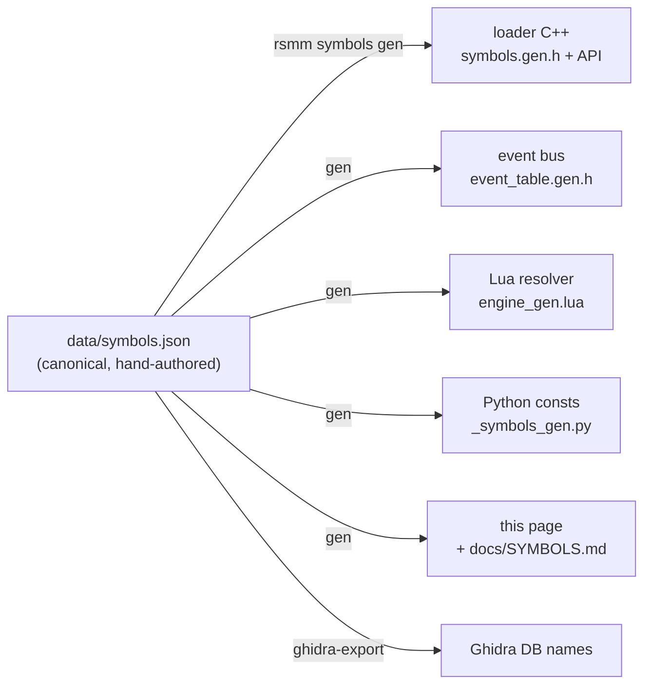

One human-authored source (`data/symbols.json`) generates every downstream artifact:

> GENERATED by `rsmm symbols gen` from `data/symbols.json` — do not edit by hand.

Canonical map of Ravenswatch engine functions/globals/events to stable
semantic names. `status`: **ok** = resolvable by byte pattern in the current
corpus (survives game updates); **va** = base-relative absolute (data globals);
**unverified** = documented in an older corpus, address not re-confirmed.
Functions tagged `callable` have a typed C++ accessor in `engine::` and a Lua
resolver entry. See [CLAUDE.md] for the workflow.

Total: **41** symbols across 9 categories.

## engine

| name | address | status | callable | signature / note |
|------|---------|--------|----------|------------------|
| `Entry_Ctor` | `0x140214bb0` | ✅ ok | ✔ | void(void* base, uint32_t count) |
| `Format_String` | `0x140204f30` | ✅ ok |  | printf-style format/string builder (e.g. 'Is Hero liked by {}', 'Chance to give {} MO')… |
| `String_Assign` | `0x1405288b0` | ✅ ok | ✔ | void(void* dst_slot, const StringDesc* src) |
| `Vector_Grow` | `0x140154c20` | ✅ ok | ✔ | void(void* vec, void* /*dead RDX*/, uint32_t new_cap /*R8*/) |

## entity

| name | address | status | callable | signature / note |
|------|---------|--------|----------|------------------|
| `Entity_AllocInstance` | `0x14068fe90` | ❓ unverified |  | void*(void* resource_plus_0x18) |
| `Entity_FindComponentByType` | `0x1406ca380` | ✅ ok | ✔ | oIEntityCpnt*(oCEntitySpawnerGo* go, oCMetaClass* meta) |
| `Entity_FindMagicalObjectComponent` | `0x1406e2250` | ❓ unverified |  | void*(void* instance, void* mo_component_meta) |
| `g_MagicalObjectComponentMeta` | `0x141470768` | 📍 va |  | oCMetaClass* for the magical-object component; passed to Entity_FindMagicalObjectCompon… |

## event

| name | address | status | callable | signature / note |
|------|---------|--------|----------|------------------|
| `Event_LevelUp` → `level_up` | `0x1401f6410` | ✅ ok | ✔ | Emitter whose body references the 'level_up_reach' string (xref 0x1401f64a4). void(ctx,… |
| `Event_RunEnd` → `run_end` | `0x1401f51e0` | ✅ ok | ✔ | Emitter whose body references the 'run_end' string (xref 0x1401f5347). Loader post-deto… |

## items

| name | address | status | callable | signature / note |
|------|---------|--------|----------|------------------|
| `InitialLoading_SpawnMagicalObjects` | `0x140260280` | ❓ unverified |  | Boot 'InitialLoading - MagicalObject SpawnAllObjects' caller that invokes SpawnAllObjec… |
| `MagicalObjectPool_Grow` | `0x1401550d0` | ❓ unverified |  | void(void* pool_plus_0x10, uint32_t count, uint32_t by) |
| `MagicalObjectPool_SourceLookup` | `0x1402590c0` | ❓ unverified |  | void*(void* pool, void* out, void* id) |
| `MagicalObject_SpawnAllObjects` | `0x140258760` | ✅ ok | ✔ | void(void* pool, void* scene) |
| `MagicalObject_SpawnContainingFunc` | `0x1402586f0` | ✅ ok |  | Outer function (1283 bytes) that contains the inlined SpawnAllObjects entry at +0x70. T… |
| `g_MagicalObjectPool` | `0x1414365d0` | 📍 va |  | Magical-object pool global pointer. Layout at *ptr: +0x0 source array, +0x8 source coun… |

## library

| name | address | status | callable | signature / note |
|------|---------|--------|----------|------------------|
| `Library_AchievementDefinition_vftable` | `0x1414113b0` | 📍 va |  | vftable of oCTLibrary<oe::dt::AchievementDefinition> singleton. |
| `Library_ChallengeDefinition_vftable` | `0x141413010` | 📍 va |  | vftable of oCTLibrary<oe::dt::ChallengeDefinition> singleton. |
| `Library_DreamShardDefinition_vftable` | `0x141411050` | 📍 va |  | vftable of oCTLibrary<oCDtDreamShardDefinition> singleton. |
| `Library_EnemyCampDifficultyDefinition_vftable` | `0x141411710` | 📍 va |  | vftable of oCTLibrary<oCDtEnemyCampDifficultyDefinition> singleton. |
| `Library_EnemyCampTierDefinition_vftable` | `0x141411560` | 📍 va |  | vftable of oCTLibrary<oCDtEnemyCampTierDefinition> singleton. |
| `Library_EnemyDefinition_vftable` | `0x1414118c0` | 📍 va |  | vftable of oCTLibrary<oCDtEnemyDefinition> singleton. |
| `Library_EnemyTribeDefinition_vftable` | `0x141411200` | 📍 va |  | vftable of oCTLibrary<oCDtEnemyTribeDefinition> singleton. |
| `Library_EntitySettingsResource_vftable` | `0x141441b60` | 📍 va |  | vftable of oCTLibrary<oCEntitySettingsResource> singleton. |
| `Library_GameModifierDefinition_vftable` | `0x141411b50` | 📍 va |  | vftable of oCTLibrary<oe::dt::GameModifierDefinition> singleton. |
| `Library_IngredientDefinition_vftable` | `0x141412c50` | 📍 va |  | vftable of oCTLibrary<oCDtIngredientDefinition> singleton. |
| `Library_MapDefinition_vftable` | `0x141412520` | 📍 va |  | vftable of oCTLibrary<oCDtMapDefinition> singleton. |
| `Library_MelodyDefinition_vftable` | `0x1414129c0` | 📍 va |  | vftable of oCTLibrary<MelodyDefinition> singleton. |
| `Library_RewardDefinition_vftable` | `0x141412e00` | 📍 va |  | vftable of oCTLibrary<oCDtRewardDefinition> singleton. |
| `Library_TileDefinition_vftable` | `0x141412080` | 📍 va |  | vftable of oCTLibrary<oCDtTileDefinition> singleton. |
| `Library_VersionDefinition_vftable` | `0x141412300` | 📍 va |  | vftable of oCTLibrary<oe::dt::VersionDefinition> singleton (LiveOps version manifest). |

## netcode

| name | address | status | callable | signature / note |
|------|---------|--------|----------|------------------|
| `Netcode_Channel_LookupById` | `0x140241150` | ❓ unverified |  | Channel-lookup-by-id; paired with subscribe for named gameplay events (GIVE_MAGICAL_OBJ… |
| `Netcode_Channel_Subscribe` | `0x1401c8660` | ❓ unverified |  | Subscribe to a gameplay-event channel. Address from events corpus. |
| `Netcode_DropPeer` | `0x1402b4450` | ❓ unverified |  | Drops a peer after the reconnect window (default 60s) elapses. Address from netcode cor… |
| `Netcode_PeerStateTick` | `0x1402afaa0` | ❓ unverified |  | Per-peer connection-state tick (peer conn-state enum at peer+0xCC; 3=connected). Reconn… |

## resource

| name | address | status | callable | signature / note |
|------|---------|--------|----------|------------------|
| `Definitions_LoadGroup` | `0x14030fa00` | ❓ unverified |  | Loads the 'Definitions' group / VersionDefinition manifest (triggers loading the curate… |
| `Resource_LookupByPath` | `0x140487040` | ✅ ok | ✔ | void*(const char* decoded_path, void*, void*, void*) |

## rewards

| name | address | status | callable | signature / note |
|------|---------|--------|----------|------------------|
| `Reward_InitAllRewards` | `0x1401e6030` | ✅ ok |  | _InitAllRewards (7351 bytes): reward-type registrar. The actual reward roller is a sibl… |

## skins

| name | address | status | callable | signature / note |
|------|---------|--------|----------|------------------|
| `SkinGrid_Populate` | `0x1401f0f10` | ✅ ok | ✔ | void(void* ctx, void* arg) |
| `SkinRoster_Build` | `0x1401dcae0` | ✅ ok |  | Skin-pack roster builder. Selectable-skin count (9) is baked into its loop; a new selec… |
| `g_RosterManager` | `0x141436590` | 📍 va |  | Manager pointer global (relocated by the live image base) walked by the skin-grid popul… |