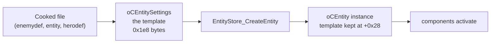
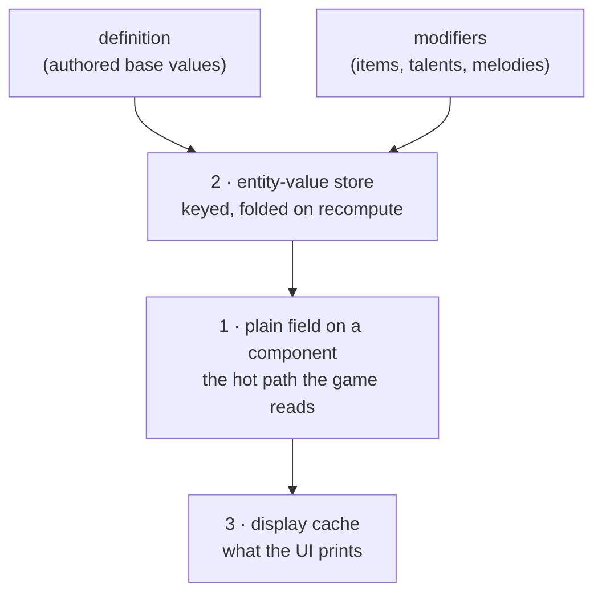
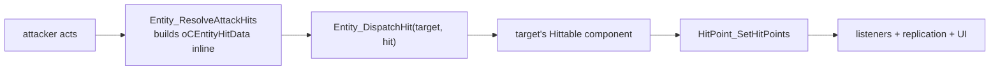

:::note
Status: assembled from symbols that are individually proven — several in game
(the health chain, the hit resolver, the entity-value store, the component
lookup). Every offset here is quoted from `data/symbols.json`; where a reading
is static-only or disputed it says so inline.
:::

Every other page in this section describes one system. This one describes the
thing all of them hang off: the **entity**. Read it first if you have ever
wondered why `R.hp` and `R.stat` reach into completely different places, or why
a stat you successfully changed still displayed as `0`.

## Everything in the world is an entity

A hero, a gnoll, a barrel, a shrine, a dropped item and the boss are all the
same C++ class: `oCEntity` — class id `0x05146457`, `0x640` bytes.

What is surprising the first time you look at one is how **little** an entity
holds. There is no health field on it, no damage, no name, no faction. It owns
a transform, a few links to the world around it, and a bag of components:

| Offset | What it is |
|---|---|
| `+0x08` | owner / back-pointer used by components (`component+0x08` is the owning entity) |
| `+0x28` | the **definition** it was built from — the template, see below |
| `+0x30` | the scene it belongs to |
| `+0x38` | the spawner that placed it |
| `+0x208` | the on-spawned functor copied from its spawn data |
| `+0x324` | position (rotation and scale follow) |
| `+0x500` | the event pool its components register listeners on |
| `+0x5e8` / `+0x5f0` / `+0x600` | the **component map** — control bytes, slots, mask |

Everything a thing in Ravenswatch can *do* is a component in that map. An
entity with a `HitPoint` component can be killed; one without it cannot be
damaged at all, no matter what the attack does.

## Definition versus instance

Mods almost never touch a live entity. They edit the **definition** — the
authored, cooked template — and let the engine build instances from it.



`EntityStore_CreateEntity` (`FUN_1406f5dc0`) is the one spawn primitive, proven
in game on 2026-09-13: give it a spawner, a template and a spawn-data record
and it returns a live entity that the engine then treats as its own. `R.spawn`
is built directly on it.

This split is why [Enemies](/reverse-engineering/enemies/) notes that **HP,
damage and move speed are not on the enemy definition**: `oCDtEnemyDefinition`
spends its `0x350` bytes on tags, tier curves and resource references, and the
actual stat block lives on the `oCEntitySettings` it points at. Change the
numbers by editing the referenced entity, not the enemydef.

## The component model

There are **188 component classes** in the shipped registry
(`data/class_ids.json`, mined by `tools/mine_class_ids.py`). They follow a
naming convention that is worth learning, because it tells you where a value
lives before you open a disassembler:

| Suffix | Count | Meaning |
|---|---|---|
| *(none)* | 188 | the live component — runtime state |
| `…Settings` | 176 | the **authored** data it is built from — this is what a mod edits |
| `…NetworkData` | 17 | the slice that replicates to other players |
| `…PersistentData` | 14 | the slice that survives a chapter transition |

So `oCEntityCpntHitPoint` is the live health component, `…HitPointSettings` is
the starting values a designer typed in, and `…HitPointPersistentData` is what
carries across a chapter. When you are hunting for "where is the note count
stored", the `PersistentData` list is only 14 entries long and is the right
place to look first.

The components that matter most:

| Component | Class id | Size | Role |
|---|---|---|---|
| `oCEntityCpntHitPoint` | `0x0fdffbf9` | `0x238` | current and max health. **Every damageable entity has one, enemies included.** |
| `oCDtEntityCpntCharacterController` | `0x1560fd89` | `0xba0` | the hub: links to the HitPoint component *and* to the entity-value store |
| `oCDtEntityCpntHeroController` | `0x155aac59` | `0x1e48` | the hero brain — abilities, dream shards, HUD, per-hit log |
| `oCDtEntityCpntEnemyController` | `0x1561073c` | `0x118` | the enemy counterpart, and how `R.damage` tells an enemy from a prop |
| `oCDtEntityCpntHittable` | `0x15596096` | `0x2b0` | the receiving half of the hit pipeline |
| `oCEntityCpntNetwork` | — | — | replication identity (RakNet under the hood) |

### Finding a component

The engine never reads a component from a fixed offset. It asks the class:

- `Entity_GetComponentFast` (`FUN_1406e31a0`) — resolve through the type→index
  hash map, then confirm with a virtual `IsKindOf`. Needs the 32-bit class key.
- `Entity_GetComponentByTester` (`FUN_1406e3210`) — linear scan, confirming each
  candidate against a type tester. Use this when the key is unknown.

:::caution[There is no fixed slot per component type]
Session 7068 chased `entity+0x678` / `entity+0xad8` chains and they were heap
coincidence — that conclusion still stands and is recorded in
[RE notes](/reverse-engineering/notes/). Never seed a chain to a component.

Two layouts get confused here. The plain array at `+0x190` with its count at
`+0x198` belongs to `oCEntitySpawnerGo`, **not** to `oCEntity`; reading it on a
plain entity yields garbage or an unrelated vector that looks plausible, which
cost a playtest on 2026-08-17. An `oCEntity`'s components are in the map at
`+0x5e8`/`+0x5f0`/`+0x600`, keyed by class id. `R.entity.components()` reads the
`+0x190` form and guards every step (pointer plausibility, a bounded count, and
a vftable slot that must literally be `mov eax, imm32; ret`), so it fails closed
rather than inventing components — but it is the spawner-go shape, and that is
why it can return `nil` on something that plainly has components.
:::

## Where a number actually lives

This is the part that catches everyone. There is no single "stat block". A
gameplay quantity lives in one of **three** places, and they are updated at
different times by different code.



**1 — A plain field on a component.** The hot path. Health is a float at
`hitpoint+0xe8` with its maximum at `+0xec`. Dream shards are a float at
`heroController+0x15c8`. These are read every frame by gameplay code, so they
are plain, unkeyed and fast. A mod reads and writes them through `R.hp` and
`R.shards`.

**2 — The entity-value store.** Almost everything else: attack power, cooldown
reduction, status-effect stacks, the hundreds of item and talent effects. Each
value is addressed by a 32-bit key, and the stored number is *computed*:
`EntityValueStore_Recompute` seeds each key from the definition's base value and
then folds in every registered modifier in priority order. See
[Entity values](/reverse-engineering/entity-values/) for the layout and
[Stats & XP](/reverse-engineering/stats/) for the 221-key catalog.

:::caution[A raw poke into the store does not stick]
Writing a value straight into the override cache works right up until the next
recompute, which any gameplay event can trigger — and the recompute rebuilds
that entry from base + modifiers and discards your write. A durable change has
to **be** a modifier. That is why `R.stat.modify` dispatches the game's own
`ADD_MODIFIER` event on the hero's bus rather than poking memory.
:::

**3 — A display cache.** The in-run stat strip does **not** read the store. It
reads three floats out of a cached report object, refreshed only when the engine
folds a modifier. This is exactly why a working attack-power change once showed
`0` on the strip: the store had the new number, the damage code used it, and the
cache nobody had refreshed still held the old one. `R.stat.cached` reads that
cache so a mod can see what the player sees.

Which to use:

| Quantity | Lives in | Read / write it with |
|---|---|---|
| Health, max health | HitPoint component | `R.hp.get` / `set` / `heal` / `damage` |
| Dream shards | hero controller field | `R.shards.get` / `add` / `spend` |
| Attack power, cooldowns, ~200 more | entity-value store | `R.stat.get` / `R.stat.modify` |
| Status stacks (ignite, chilled, …) | entity-value store | `R.stat` with a `status_*` key |
| Armour | **nowhere addressable** | not exposed — see below |
| What the stat strip prints | display cache | `R.stat.cached` |
| Experience | XP component | `R.xp` |

:::note[Armour is the exception that proves the rule]
Armour is registered into the value store with **key `0`**. It has a display
name and an editor icon, but no id, so nothing can address it — no `R.stat` call
can ever read or write it. Its live value is a plain field. The five armour
*effects* ("Armour per missing health" and friends) are keyed normally and work.
Full detail in [Stats & XP](/reverse-engineering/stats/).
:::

## Health

The chain, measured in game on 2026-09-18:

```text
heroController + 0x2f8   -> oCDtEntityCpntCharacterController
             ... + 0x78  -> oCEntityCpntHitPoint
             ... + 0xe8  = current HP (f32)
             ... + 0xec  = max HP (f32)
             ... + 0x08  = the owning oCEntity
```

Note that `+0x2f8` is the *character controller*, not the entity — and the same
object carries the entity-value store at `+0x4c8`. One hop serves both systems.

`HitPoint_SetHitPoints` (`FUN_140822db0`) is the real setter, and it does more
than store a float: it clamps to `[0, max]`, fires the death listeners at
`+0x108` when the value crosses zero, fires the change listeners at `+0xf0`,
replicates through the entity's net component, and writes current and max into
the UI bar. Thirteen gameplay readers take exactly this path and compute
`+0xe8 / +0xec` as a fraction — "increase damage at critical health" is one of
them.

`R.hp` re-checks the link on every access: the RTTI of the component must name a
HitPoint class, and `component+0x08` must equal the hero's entity. `R.hp.diagnose`
prints the whole walk with class names when something looks wrong.

:::caution[Health is host-authoritative]
In co-op the host owns HP. A client-side write is expected to be overwritten, or
to replicate only from the host. See [Multiplayer](/reverse-engineering/multiplayer/).
:::

## Damage

Damage is not a number you set. It is a **hit object** that travels a pipeline:



The amount is not a plain float on the hit: it lives in a hit-**value** object
hanging off `hitData+0xa0`, as a float at `+0x08`. The resolver returns that
same number, which is how `R.damage` reads every hit without touching the
struct at all.

There is **no** low-arity "deal N damage to entity E" function, and no
standalone constructor for the hit data — the struct is built inline inside the
resolver. Fabricating one means inventing a hit-value object with the right
vtable, a valid refcounted handle, the source net id, and the position/normal
block; any mistake corrupts the pipeline or desyncs multiplayer. The path that
works is to **ride an attack the hero already made**. The read-only half of that
ships today as `R.damage`. Full detail, including the corrected layout, is in
[Combat & damage](/reverse-engineering/combat-damage/).

## Heroes versus enemies

They are the same class with different components. What actually differs:

| | Hero | Enemy |
|---|---|---|
| Controller | `HeroController` (`0x1e48` bytes) | `EnemyController` (`0x118` bytes) |
| Health | HitPoint component | HitPoint component — **the same one** |
| Entity values | full store, hundreds of keys | store present, far fewer keys |
| HUD mirror | `+0x1d80`, **local player only** | none |
| "Is this me" | byte at `+0x1d88` | n/a |
| Damage accounting | `HeroStats_OnDamageDealt` / `…Taken` | n/a |
| Authored by | `oCDtHeroDefinition` (no class UID — [Heroes](/reverse-engineering/heroes/)) | `oCDtEnemyDefinition` + tribe + tier |

The HUD mirror at `+0x1d80` is the single most useful discriminator in the whole
engine: only the local player's hero controller has one, so its presence is how
the SDK decides "this is the hero *I* am playing" rather than an ally or a
remote player.

The asymmetry in damage accounting is netcode, not an oversight.
`HeroStats_OnDamageDealt` fires for **every** hero in the session, local or
remote, which is what makes a co-op damage meter possible without touching the
netcode. `…OnDamageTaken` does not: a hit on an ally is applied on that ally's
machine, so a remote player's "taken" is always zero locally.

## Inspecting a live entity

You do not need Ghidra to answer "what is this thing". From a mod, on the main
thread:

```lua
local e = R.entity.hero()          -- the hero controller, once captured
R.log(R.rtti.name(e))              -- class name straight from RTTI

R.log(R.hp.diagnose())             -- the whole health walk, with class names
R.log(R.hp.get(), R.hp.max(), R.hp.frac())

for _, c in ipairs(R.entity.components(e) or {}) do
  R.log(("%x  %s"):format(c.type_id or 0, R.rtti.name(c.ptr)))
end

R.log(R.stat.get("attack_power"))  -- from the value store
R.log(R.stat.cached("attack_power"))  -- what the strip prints
```

`R.debug.dump(ptr)` prints a window of an object with pointers, floats and
strings identified; `R.debug.find_arrays(obj)` and `R.debug.strings(obj)` turn
what used to be a multi-launch struct hunt into one launch. `R.defs.classes()`
enumerates every loaded definition class.

For "who wrote this byte", `R.watch.on(va, {len=4})` arms a hardware watchpoint
and `R.watch.report()` names the writer — four slots in the whole CPU, per
thread, and the address must be aligned to its length. It needs
`RSMM_ENABLE_WATCH=1` and is a debug tool only.

:::caution[Reading is free, calling is not]
Native `read_*` is page-guarded: a bad read returns `nil` and cannot fault the
game. The moment a probed pointer becomes a **call argument**, the engine owns
the dereference and a wrong pointer is a crash. Validate with `R.ptr.*` and
prefer `R.engine.call_safe`. `Entity_GetNetId` is specifically banned from the
SDK for this reason — it walks the component map with no guard of its own, and
an entity whose slot holds the `-1` sentinel is an access violation rather than
a `nil` return.
:::

## Traps worth knowing before you start

- **`heroController+0x15c8` is dream shards, not HP.** It was documented as
  health until 2026-09-18 and the misreading reached a shipped symbol name. Real
  health is the HitPoint chain above.
- **The stat strip reads a cache.** A store write that the game honours can still
  print as `0`. Check with `R.stat.cached`.
- **A store poke is transient.** Durable changes must be modifiers.
- **`+0x190` is the spawner-go component array**, not the entity's.
- **Armour is unaddressable** (key `0`). Use the armour effects instead.
- **The definition, not the instance,** is what a mod should be editing in almost
  every case.

## See also

- [Entity values](/reverse-engineering/entity-values/) — the keyed store's read path and layout.
- [Stats & XP](/reverse-engineering/stats/) — the 221-key catalog, delivery routes, the strip cache.
- [Combat & damage](/reverse-engineering/combat-damage/) — the hit pipeline in full.
- [Enemies](/reverse-engineering/enemies/) — definitions, tribes and camp spawning.
- [Heroes](/reverse-engineering/heroes/) — why a hero definition is the hardest kind.
- [Spawn system](/reverse-engineering/spawn-system/) — creating an entity at runtime.
- [Event systems](/reverse-engineering/event-systems/) — the bus that component changes fire on.
