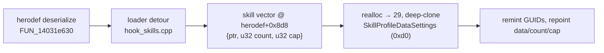

:::note
Status: reverse-engineered via Ghidra MCP **and** the headless-decompile bypass
against `Ravenswatch.exe` (image base `0x140000000`), 2026-06-15 → 2026-06-17.
In-game these are **Skills**, not "talents" — no `Talent` string exists. This page
is the RE companion to the [Custom skills guide](/guides/custom-skills/).
:::

## TL;DR verdict

| Goal | Verdict | Path |
|---|---|---|
| Relabel / restat an existing skill | **Works, shipped** | Text-bank override (`mode="relabel"`) |
| Add a net-new skill *row* by editing the `.gen` | **Disabled — bricks the hero** | versioned deserializer rejects the extra row |
| Add a net-new skill at runtime (loader) | **Inject works, no crash** | grow the herodef skill vector |
| Make that net-new skill **visible** in the Book grid | **Architectural wall** | grid cell is computed from identity, not stored |

The shippable custom-talent path is **reskin/relabel an existing skill** (proven
live: `AladdinLightningDash`). A genuinely net-new, hero-page-visible talent is
not achievable by data or runtime injection — see [the grid wall](#the-grid-wall).

## System map

| Piece | Identity | Role |
|---|---|---|
| Per-hero skill set | `oCSkillProfileData(Settings)` | the hero's owned skills |
| Storage | `Definitions/Heroes/<Hero>.herodef.ot.DtHeroDefinition.gen` | a counted collection of skill rows |
| Runtime owner | `oCDtEntityCpntSkillController` | owns/upgrades the live skills |
| Hero-page UI | `SkillUiViewerEntityCpnt` / `oCDtEntityCpntSkillUiControllerSettings`, `Menu::SkillMenu` | enumerates + renders the grid |
| Tiers | rarities Common/Rare/Epic/Legendary/Ultimate → frames `HUD_Skill_Frame_01..05` | legendary = top tier |
| Display text | `Text/Hero_<Hero>_Common~GAM.xls.LocalText`, keys `Skill_<Suffix>_Name`/`_Desc` | what the player reads |

All 12 heroes carry **exactly 28** `Skill Controller` rows — names are
hero-specific, the count is invariant.

## Why a `.gen` row-splice bricks the hero

The herodef deserializer is **`FUN_14031e630`** — a strict **versioned, ordered**
field reader, not a "read until terminator" loop:

- Each field is gated by `FUN_1404fbea0(stream, …, 0x1768d0c9)` (the herodef
  type-version hash) compared against rising thresholds, then read into a fixed
  instance offset.
- The skill set is a counted collection, but **there is no plain `u32 == 28` in
  the `.gen` before the rows** (scanned ±0x120 across all heroes). The count lives
  behind a polymorphic header / nested object — position-variable.

So a byte-spliced 29th row desyncs **every subsequent versioned field read** →
the hero fails to load and vanishes from selection. Proven twice, GUID-independent
(remint and source-GUID both brick), so identity is not the cause. The SDK's
`mode="clone"` is hard-disabled for this reason.

## Runtime injection (what works)

The correct layer is the **item-pool pattern** applied to skills: don't touch the
serialized `.gen` — after a herodef deserializes, have the loader grow the runtime
skill vector and append a cloned element.

Confirmed mechanically on all 12 heroes (no crash):

- **Skill vector = herodef `+0x8d8`** — `{void* data; u32 count; u32 cap}`, a
  pointer array (stride 8), `count == cap == 28` (exact-fit). The deserializer
  fills it via `FUN_14020d700(stream, herodef+0x8d8)`.
- Elements are **`oe::dt::SkillProfileDataSettings*`** — vftable `0x140efd018`,
  ctor `FUN_1400c9210`, size **`0xd0`**.
- Abilities live at herodef **`+0x8e8`** — an inline array, stride `0x240`, 7
  entries. They do **not** reference their talents (probed: zero pointers from any
  ability back into the `+0x8d8` array).

`SkillProfileDataSettings` (0xd0) field map, from runtime byte-diff:

| Offset | Meaning |
|---|---|
| `+0x00` / `+0x08` | vtables |
| `+0x10` | 16-byte **identity GUID** — engine dedups on it; remint or clones collapse |
| `+0x30` | `{ptr,u32,u32}` sub-vector of effect descriptors |
| `+0x40` | 16-byte secondary/skill ref GUID (unique per talent) |
| `+0xc0` | 0/1 flag (correlates with `+0xb8` upgrade-data ptr) — not tier |

The loader hook `hook_skills.cpp` ships this: detours `FUN_14031e630` (added as a
unique masked pattern to `data/function_patterns.json`). **Default read-only** —
logs `[skill-hook] herodef=.. skillvec count=.. cap=..`. Injection is gated behind
`RSMM_ENABLE_SKILL_INJECT` and self-guarded (acts only on `count∈[1,200]` with a
spare slot, so a wrong offset is inert).

## The grid wall

Injecting a 29th skill **does not make it appear** in the hero Book page. The
talent grid is **column = ability category, row = upgrade tier**, and both are
**computed at build time** — there is no `(x, y)` cell stored anywhere injectable:

- No tier/column field in the `0xd0` object (probed `+0x40`/`+0x50`/`+0x60`/`+0x68`
  /`+0x90`/`+0xac`/`+0xc8` across all 28 talents — all constant or shared statics).
- Abilities (`+0x8e8`) don't own talents.
- The `SkillUiViewerEntityCpntSettings` (size `0x388`, ctor `FUN_14043b240`,
  registrar `FUN_1403656f0`, type hash `0x15f63a0f`) holds only `oCEntityCpntPicker`
  sub-objects — refs to *which* controller it drives, **not** a per-cell list.

The column is derived from the skill's **name prefix** — `Skill_Attack_*`,
`Skill_Power_*`, `Skill_Special_*`, `Skill_Defense_*`, `Skill_Ultimate_*`,
`Skill_Passive_*`, `Skill_Dash_*`, `Skill_Trait_*` — resolved via
GUID → global registry (`DAT_1414364e8`, register `FUN_140320540`) → name →
category. A runtime clone inherits its source identity, so it lands on the
source's cell (overlap → invisible).

**Conclusion:** a visible net-new cell would require forging a *complete* new
identity (new GUID + registry registration + a name whose category/tier maps to a
currently-free cell) **and** hooking the grid build method — essentially authoring
a real new skill end-to-end. That is the same wall as the `.gen` clone-insert. The
wall is architectural, not a missing datum.

## Shippable paths

1. **Reskin / relabel an existing skill** — override its `Skill_*_Name`/`_Desc`
   text values, restat with [talent values](/guides/modding/), rewire its effect
   graph by swapping the 16-byte ref GUIDs. Hero-specific, upgradeable, and
   hero-page-visible because it *is* a real row. Live and proven.
2. **Additive pickable card** via the magical-object pool — a custom level-up card
   that isn't tied to the herodef grid at all. Bind behaviour with
   `R.talent.on_pick`.

## Going deeper

- [Custom skills guide](/guides/custom-skills/) — the SDK `skill` kind.
- [Mod hooks](/reverse-engineering/mod-hooks/) — the loader detours and env flags.
- [Ghidra MCP](/reverse-engineering/ghidra-mcp/) — and the headless-decompile bypass used here.
